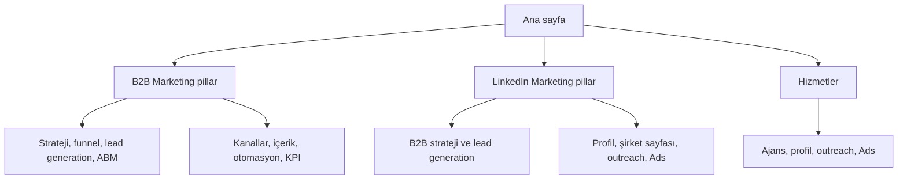

# B2B Marketing ve LinkedIn Marketing SEO/GEO İçerik Mimarisi

Bu dosya, B2B marketing ve LinkedIn marketing hizmeti sunan bir web sitesinde yapay zekânın SEO ve GEO uyumlu sayfa, rehber, karşılaştırma, vaka analizi ve hizmet içeriği üretmesi için hazırlanmış ana talimat setidir.

## 1. Kullanım amacı

Bu dosyayı içerik üretim sistemine ana bağlam olarak ver. Her yeni sayfa üretiminde önce doğru konu kümesini, arama niyetini, kanonik URL'yi ve iç linkleri seç. Aynı arama niyetini hedefleyen iki farklı sayfa oluşturma. Bir konu zaten bir kanonik sayfaya bağlıysa yeni içerik o sayfayı desteklemeli, onunla rekabet etmemeli.

Bu mimari iki hedefi birlikte taşır:

- B2B pazarlama stratejisi, lead generation, ABM, içerik, CRM, otomasyon ve analitik konularında bilgi merkezi oluşturmak.
- LinkedIn profil danışmanlığı, şirket sayfası yönetimi, içerik, outreach, Sales Navigator, LinkedIn Ads ve B2B müşteri kazanımı hizmetlerini ticari sayfalara bağlamak.

## 2. Proje değişkenleri

İçerik üretirken aşağıdaki alanları gerçek bilgilerle doldur. Bilinmeyen alanları uydurma; `[yer tutucu]` olarak bırak veya içerik yayınlanmadan önce insan onayı iste.

| Alan | Değer |
|---|---|
| Marka | `[MARKA_ADI]` |
| Alan adı | `[DOMAIN]` |
| Ana pazar | Türkiye; gerekiyorsa ülke/şehir `[HEDEF_PAZAR]` |
| Hizmet odağı | B2B marketing, LinkedIn marketing, LinkedIn outreach, profil ve şirket sayfası yönetimi, LinkedIn Ads |
| Hedef şirketler | `[sektör]`, `[çalışan sayısı]`, `[ciro veya büyüklük]`, `[B2B satış modeli]` |
| Hedef pozisyonlar | Kurucu, CEO, genel müdür, satış direktörü, pazarlama direktörü, satın alma, kurumsal iletişim, iş geliştirme |
| Ana dönüşüm | Strateji görüşmesi, profil analizi, hedef hesap çalışması veya teklif talebi |
| Dil | Türkçe; istenirse aynı URL mimarisinde İngilizce eş sayfa |
| Kanıt | Gerçek vaka, süreç, ekip deneyimi, ekran görüntüsü, müşteri yorumu veya ölçülebilir sonuç; yoksa iddia üretme |

## 3. Kaynak Excel özeti ve işleme kararı

- B2B Marketing dosyası: 571 benzersiz ifade.
- LinkedIn Marketing dosyası: 478 benzersiz ifade.
- Birleşik benzersiz ifade sayısı: 1.048.
- İki dosyada ortak ifade: `linkedin b2b marketing benchmark report 2025`.
- Kaynak ifadeler aşağıdaki eklerde korunmuştur. Aynı kelimeyi her sayfada tekrar etmek yerine, her kümeye bir kanonik sayfa atandı.

### Kelime önceliklendirmesi

1. **Ticari çekirdek:** Ajans, hizmet, fiyat, danışman, lead generation, LinkedIn Ads, outreach ve müşteri kazanımı ifadeleri hizmet sayfalarına gider.
2. **Stratejik destek:** Nedir, nasıl yapılır, strateji, funnel, ABM, KPI, otomasyon ve kanal ifadeleri rehber/pillar sayfalarına gider.
3. **Sektör kümeleri:** SaaS, teknoloji, üretim, sağlık, finans, gayrimenkul ve profesyonel hizmetler gerçek uzmanlık veya kanıt varsa ayrı sayfaya dönüşür.
4. **Araştırma kümeleri:** İş ilanı, maaş, kurs, sertifika, sınav, kitap/PDF, etkinlik ve belirli kişi/marka sorguları ana hizmet sayfalarına zorla eklenmez.
5. **Gürültü veya marka sorguları:** Anlamsız, kesilmiş, yazım hatalı, kişiye/şirkete özel veya başka niyet taşıyan ifadeler içerik üretiminde kullanılmaz. Gerekirse `noindex` araştırma alanında tutulur.

## 4. Eklenen eksik kelimeler

Kaynak dosyalar ağırlıklı olarak İngilizce sorgulardan oluştuğu için, Türkiye'deki hizmet aramalarını ve doğal dil sorgularını tamamlamak üzere aşağıdaki kelimeler eklendi.


### Türkçe ana ticari kelimeler

- b2b pazarlama
- b2b pazarlama nedir
- b2b pazarlama stratejisi
- b2b pazarlama ajansı
- b2b pazarlama hizmetleri
- b2b müşteri kazanımı
- b2b lead generation
- b2b satış ve pazarlama
- b2b talep yaratma
- b2b içerik pazarlaması
- b2b dijital pazarlama
- b2b pazarlama otomasyonu
- b2b pazarlama hunisi
- b2b pazarlama kanalları
- b2b pazarlama analitiği
- b2b pazarlama kpi
- linkedin b2b pazarlama
- linkedin pazarlama
- linkedin pazarlama ajansı
- linkedin lead generation
- linkedin müşteri kazanımı
- linkedin outreach
- linkedin mesajlaşma
- linkedin profil optimizasyonu
- linkedin şirket sayfası yönetimi
- linkedin içerik yönetimi
- linkedin reklam yönetimi
- linkedin ads ajansı
- linkedin sales navigator
- linkedin bağlantı kurma
- linkedin hedef kitle analizi

### İngilizce eksik ticari varyantlar

- b2b demand generation
- b2b lead generation agency
- b2b content marketing agency
- b2b growth marketing agency
- b2b digital marketing agency
- b2b marketing consultant
- b2b marketing services
- b2b marketing for small business
- b2b marketing for professional services
- b2b marketing for healthcare
- b2b marketing for real estate
- b2b marketing for financial services
- b2b marketing for technology companies
- b2b buyer journey
- ideal customer profile b2b
- b2b buyer persona
- account based marketing agency
- abm strategy b2b
- b2b content strategy
- b2b marketing attribution
- b2b intent data
- b2b marketing roi
- linkedin lead generation agency
- linkedin outreach agency
- linkedin profile optimization service
- linkedin company page management
- linkedin content marketing
- linkedin personal branding for executives
- linkedin advertising agency
- linkedin ads management
- linkedin campaign management
- linkedin sales navigator lead generation
- linkedin outreach strategy
- linkedin prospecting
- linkedin message sequence
- linkedin connection strategy
- linkedin marketing analytics

### GEO ve arama niyeti varyantları

- b2b marketing nedir ve nasıl yapılır
- b2b pazarlama nasıl yapılır
- linkedin pazarlama nasıl yapılır
- linkedin marketing nedir ve nasıl yapılır
- linkedin ile müşteri nasıl bulunur
- linkedin üzerinden satış nasıl yapılır
- b2b pazarlamada hedef kitle nasıl belirlenir
- linkedin hedef kitle nasıl bulunur
- b2b pazarlama örnekleri
- linkedin pazarlama örnekleri
- b2b pazarlama ajansı nasıl seçilir
- linkedin pazarlama ajansı nasıl seçilir
- linkedin marketing fiyatları
- linkedin reklam maliyeti
- b2b lead generation fiyatları
- linkedin outreach otomasyonu
- linkedin otomasyon güvenli mi
- linkedin mesaj şablonları

## 5. Kanonik site mimarisi

Kullanılacak URL yapısı kısa, açıklayıcı ve konu klasörleriyle uyumlu olmalı. Aşağıdaki yapı öneridir; mevcut sitede farklı URL'ler varsa yeni sayfa açmadan önce kanonik eşleştirme ve 301 planı yapılmalıdır.



### Ana sayfa

- Hedef: `b2b marketing`, `linkedin marketing`, `b2b marketing agency`, `linkedin marketing agency`.
- İlk ekran: Kimin hangi iş sonucuna ulaştırıldığı açıkça yazılmalı.
- Bölümler: problem, hizmet modeli, hedef kitle, süreç, kanıt, hizmetler, kaynaklar, sık sorulan sorular, CTA.
- Ana sayfada tüm kelimeleri sıralama. Her konu için ilgili kanonik sayfaya doğal bağ ver.

### B2B Marketing kümesi

| Sayfa | URL | Ana konu |
|---|---|---|
| B2B Marketing pillar | `/b2b-marketing/` | Tanım, kanallar, strateji ve genel çerçeve |
| B2B Marketing stratejisi | `/b2b-marketing/stratejisi/` | Plan, ICP, buyer journey, hedefler |
| B2B Lead Generation | `/b2b-marketing/lead-generation/` | Lead, MQL, SQL, nurturing ve satışa devir |
| ABM | `/b2b-marketing/abm/` | Hedef hesap ve karar verici odaklı pazarlama |
| B2B funnel | `/b2b-marketing/funnel/` | Buyer journey ve funnel aşamaları |
| B2B kanalları | `/b2b-marketing/kanallari/` | LinkedIn, SEO, Google Ads, e-posta ve içerik |
| B2B içerik | `/b2b-marketing/content/` | İçerik stratejisi, format ve dağıtım |
| B2B otomasyon | `/b2b-marketing/otomasyon/` | CRM, AI, automation ve uyum |
| B2B KPI | `/b2b-marketing/kpi/` | Analitik, attribution, pipeline ve ROI |

### LinkedIn Marketing kümesi

| Sayfa | URL | Ana konu |
|---|---|---|
| LinkedIn Marketing pillar | `/linkedin-marketing/` | LinkedIn'in B2B'deki genel rolü |
| LinkedIn stratejisi | `/linkedin-marketing/stratejisi/` | Organik, kişisel marka, outreach ve Ads planı |
| LinkedIn B2B marketing | `/linkedin-marketing/b2b/` | Şirket ve karar verici odaklı kullanım |
| LinkedIn lead generation | `/linkedin-marketing/lead-generation/` | Hedef kitle, bağlantı, mesaj ve lead kalitesi |
| LinkedIn outreach | `/linkedin-marketing/outreach/` | Mesaj dizisi, takip, insan kontrolü ve güven |
| Profil optimizasyonu | `/linkedin-marketing/profile-optimization/` | Başlık, Hakkında, kanıt, banner ve CTA |
| Şirket sayfası | `/linkedin-marketing/company-page/` | Sayfa yönetimi, içerik ve çalışan savunuculuğu |
| LinkedIn Ads | `/linkedin-marketing/linkedin-ads/` | Hedefleme, kampanya, lead form, retargeting |
| Sales Navigator | `/linkedin-marketing/sales-navigator/` | Hedef hesap ve karar verici araştırması |
| LinkedIn analytics | `/linkedin-marketing/analytics/` | Gösterim, etkileşim, lead, toplantı ve gelir katkısı |

### Hizmet sayfaları

| Sayfa | URL | Ticari kelime ailesi |
|---|---|---|
| B2B Marketing Ajansı | `/hizmetler/b2b-marketing-ajansi/` | b2b marketing agency, b2b pazarlama ajansı, b2b marketing services |
| LinkedIn Marketing Ajansı | `/hizmetler/linkedin-marketing-ajansi/` | linkedin marketing agency, linkedin pazarlama ajansı |
| LinkedIn Profil Danışmanlığı | `/hizmetler/linkedin-profil-danismanligi/` | profile optimization, personal branding, profil danışmanlığı |
| LinkedIn Şirket Sayfası Yönetimi | `/hizmetler/linkedin-sirket-sayfasi-yonetimi/` | company page management, içerik yönetimi |
| LinkedIn Ads Yönetimi | `/hizmetler/linkedin-ads-yonetimi/` | LinkedIn Ads agency, ads management, reklam yönetimi |
| LinkedIn Outreach | `/hizmetler/linkedin-outreach/` | outreach agency, prospecting, lead generation |
| B2B Lead Generation | `/hizmetler/b2b-lead-generation/` | lead generation agency, müşteri kazanımı, demand generation |

## 6. Sayfa başlıkları ve kelime yerleşimi

Her sayfa için tek bir birincil arama niyeti seç. Ana kelimeyi title, H1, girişin ilk bölümünde ve en az bir doğal alt başlıkta kullan. Her varyasyonu zorla tekrar etme. Google, anlam ve sorgu varyasyonlarını anlayabilir; keyword stuffing yapma.

| Alan | Kural |
|---|---|
| URL | Küçük harf, kısa, Türkçe karakter yok, konu klasörüyle uyumlu. Tarihi yalnızca gerçekten güncellenen raporlarda kullan. |
| Title | 50–60 karakteri hedefle; sayfanın gerçek vaadini ve gerekiyorsa konumu belirt. |
| H1 | Title'ı aynen kopyalamak zorunda değil; kullanıcı sorusunu veya sonucu açıkça cevapla. |
| İlk paragraf | İlk 80–120 kelimede doğrudan tanım, kapsam ve kime uygun olduğu yazılsın. |
| H2/H3 | Arama niyetindeki alt soruları cevaplasın; başlıklar keyword listesi gibi görünmesin. |
| Meta description | 140–160 karakter civarı; fayda, kapsam ve CTA içersin; garanti veya kanıtsız sayı vermesin. |
| Görseller | Anlamlı dosya adı, açıklayıcı alt metin, görselin yakınında bağlam. |
| CTA | Sayfa niyetine tek ana CTA; ikincil CTA yalnızca kullanıcıyı bir sonraki mantıklı adıma götürüyorsa. |
| Kaynaklar | İstatistik, platform özelliği, mevzuat veya fiyat gibi değişebilir iddialar için birincil kaynak ve erişim tarihi. |

### Başlık üretim formülleri

- `[Ana konu] nedir? [İşletmeler için uygulama rehberi]`
- `[Ana konu] nasıl yapılır? [Adım adım strateji]`
- `[Ana konu] ve [yakın konu] arasındaki fark`
- `[Hedef kitle] için [ana konu]: [süreç veya sonuç]`
- `[Hizmet] nasıl çalışır? [Kapsam, süreç ve doğru seçim kriterleri]`

Başlıkta `en iyi`, `garantili`, `kesin sonuç`, `%X artış` gibi iddiaları kanıt yoksa kullanma.

## 7. İçerik üretim standardı: SEO ve GEO

GEO burada, yapay zekâ destekli arama sonuçlarında içeriğin doğru anlaşılmasını ve kaynak gösterilmeye uygun olmasını hedefleyen içerik düzenidir. Sıralama veya AI yanıtında görünme garantisi verme.

### Her yazı için zorunlu yapı

1. **Özet cevap:** İlk bölümde konuya net cevap ver.
2. **Kavram açıklaması:** Terimleri tanımla; B2B, B2C, ICP, buyer persona, MQL, SQL, ABM ve outreach gibi kısaltmaları ilk kullanımda aç.
3. **Uygulama çerçevesi:** Adımları sırala ve her adımın nedenini açıkla.
4. **Örnek:** Gerçek değilse `örnek senaryo` diye etiketle. Müşteri adı, rakam veya sonuç uydurma.
5. **Karar desteği:** Hangi durumda hangi kanalın, hizmetin veya yaklaşımın uygun olmadığını da anlat.
6. **Kontrol listesi:** Kullanıcının uygulayabileceği kısa bir liste ekle.
7. **SSS:** Sayfanın cevaplamadığı ama arama niyetinde bulunan 3–6 soruyu yanıtla.
8. **İç linkler:** En az 3, genellikle 5–8 bağlamsal iç link ekle. Linkleri paragrafın doğal anlamına yerleştir.
9. **Kaynaklar:** Değişken ve kanıt gerektiren iddiaları kaynaklandır.
10. **Güncelleme notu:** İçerik değişken bilgi içeriyorsa `Son gözden geçirme: YYYY-MM-DD` alanı kullan.

### GEO için cevaplanabilir paragraf standardı

- Her H2'nin hemen altında 40–80 kelimelik doğrudan cevap bulunmalı.
- Ardından açıklama, adımlar, örnek veya tablo gelmeli.
- Bir paragraf tek bir ana iddia taşımalı.
- Tanım, koşul, istisna ve ölçüm ayrımını açıkça yaz.
- `Bu yöntem işletmeler için büyük fark yaratır` gibi belirsiz cümleler yerine hangi koşulda neyin değiştiğini anlat.
- Bir iddia kaynağa dayanmıyorsa kesinlik dili kullanma: `genellikle`, `test edilerek`, `veriye bağlı olarak`.
- İçeriği yalnızca AI özeti alınsın diye kısa ve yüzeysel yapma. Kullanıcıya özgün süreç, örnek, karşılaştırma, deneyim ve karar ölçütü sağla.

### İçerik güveni ve uyum

- LinkedIn'in güncel kullanım şartları, platform limitleri, API erişimi ve otomasyon kuralları kontrol edilmeden teknik garanti verme.
- KVKK, GDPR, e-posta izinleri, opt-out, kişisel veri minimizasyonu ve veri saklama süresi konularında hukuki kesinlik iddiası kurma; gerektiğinde hukuk danışmanına yönlendir.
- Yetkisiz scraping, sahte kimlik, toplu spam veya platform kısıtlarını aşma anlatısı oluşturma.
- AI, sadece araştırma ve taslak desteği olarak konumlandırılsın. Son mesaj, hedefleme ve yayın kararı insan kontrolünden geçsin.

## 8. İç linkleme kuralları ve anchor bankası

### Anchor seçimi

Anchor, bağlandığı sayfanın ne anlattığını kullanıcıya söylemeli. Her linkte aynı exact-match ifadeyi kullanma. Aşağıdaki varyasyonları bağlama göre döndür:

| Hedef sayfa | Exact veya yakın anchor örnekleri |
|---|---|
| `/b2b-marketing/` | b2b marketing, B2B pazarlama rehberi, B2B marketing temelleri |
| `/b2b-marketing/stratejisi/` | B2B marketing stratejisi, B2B pazarlama planı, strateji oluşturma |
| `/b2b-marketing/lead-generation/` | B2B lead generation, nitelikli müşteri adayı kazanımı, B2B müşteri kazanımı |
| `/b2b-marketing/abm/` | ABM stratejisi, hedef hesap odaklı pazarlama, account-based marketing |
| `/b2b-marketing/funnel/` | B2B marketing funnel, satın alma yolculuğu, B2B dönüşüm hunisi |
| `/b2b-marketing/kanallari/` | B2B pazarlama kanalları, kanal karması, dijital B2B kanalları |
| `/b2b-marketing/otomasyon/` | B2B pazarlama otomasyonu, CRM ve AI, pazarlama süreç otomasyonu |
| `/b2b-marketing/kpi/` | B2B pazarlama KPI'ları, pazarlama analitiği, ROI ölçümü |
| `/linkedin-marketing/` | LinkedIn marketing, LinkedIn pazarlama rehberi, LinkedIn'in B2B'deki rolü |
| `/linkedin-marketing/stratejisi/` | LinkedIn marketing stratejisi, LinkedIn planı, LinkedIn büyüme stratejisi |
| `/linkedin-marketing/b2b/` | LinkedIn B2B marketing, LinkedIn ile B2B pazarlama, karar verici pazarlaması |
| `/linkedin-marketing/lead-generation/` | LinkedIn lead generation, LinkedIn müşteri kazanımı, LinkedIn'de lead bulma |
| `/linkedin-marketing/outreach/` | LinkedIn outreach, LinkedIn mesajlaşma, bağlantı ve takip süreci |
| `/linkedin-marketing/profile-optimization/` | LinkedIn profil optimizasyonu, yönetici LinkedIn profili, kişisel marka profili |
| `/linkedin-marketing/company-page/` | LinkedIn şirket sayfası yönetimi, şirket sayfası içerik stratejisi |
| `/linkedin-marketing/linkedin-ads/` | LinkedIn Ads, LinkedIn reklam yönetimi, ücretli LinkedIn kampanyaları |
| `/linkedin-marketing/sales-navigator/` | Sales Navigator ile hedefleme, karar verici araştırması, hedef hesap listesi |
| `/hizmetler/b2b-marketing-ajansi/` | B2B marketing ajansı, B2B pazarlama hizmeti, B2B strateji desteği |
| `/hizmetler/linkedin-marketing-ajansi/` | LinkedIn marketing ajansı, LinkedIn pazarlama hizmeti, LinkedIn büyüme desteği |
| `/hizmetler/linkedin-profil-danismanligi/` | LinkedIn profil danışmanlığı, profil konumlandırma, yönetici profil çalışması |
| `/hizmetler/linkedin-outreach/` | LinkedIn outreach hizmeti, hedef karar vericilere ulaşma, LinkedIn randevu kazanımı |

### Sayfa başına linkleme planı

- Pillar sayfa: Her alt kümeye 1–2 link; ticari hizmet sayfalarına bağlam içinde 2–3 link.
- Bilgilendirici rehber: 3–8 iç link; en az biri üst pillar, biri komşu konu, biri uygun hizmet sayfası.
- Hizmet sayfası: 2–4 bilgi sayfası ve 1–2 tamamlayıcı hizmet sayfasına link.
- Vaka çalışması: İlgili strateji, kanal ve KPI sayfalarına; hizmet sayfasına doğal CTA linki.
- SSS: Her cevapta link vermek zorunda değilsin. Link yalnızca cevap için gerekli detay sayfasına götürüyorsa kullan.
- Footer'da bütün kelimeleri linkleme. Footer yalnızca ana kategori ve kurumsal sayfaları taşısın.

### Otomatik iç linkleme mantığı

```text
Eğer metinde "b2b marketing stratejisi", "b2b pazarlama planı" veya "how to create a b2b marketing strategy" geçiyorsa -> /b2b-marketing/stratejisi/
Eğer metinde "linkedin lead generation", "linkedin müşteri kazanımı" veya "linkedin prospecting" geçiyorsa -> /linkedin-marketing/lead-generation/
Eğer metinde "linkedin outreach", "mesaj dizisi" veya "linkedin connection strategy" geçiyorsa -> /linkedin-marketing/outreach/
Eğer metinde "linkedin profile optimization", "linkedin headline" veya "kişisel marka" geçiyorsa -> /linkedin-marketing/profile-optimization/
Eğer metinde "linkedin company page", "şirket sayfası yönetimi" veya "linkedin content" geçiyorsa -> /linkedin-marketing/company-page/
Eğer metinde "linkedin ads", "linkedin advertising" veya "linkedin reklam" geçiyorsa -> /linkedin-marketing/linkedin-ads/
Eğer metinde "abm", "target account list" veya "account-based marketing" geçiyorsa -> /b2b-marketing/abm/
Eğer metinde "mql", "sql", "lead qualification" veya "demand generation" geçiyorsa -> /b2b-marketing/lead-generation/
Eğer metinde "crm", "ai in b2b marketing" veya "marketing automation" geçiyorsa -> /b2b-marketing/otomasyon/
Eğer metinde "kpi", "attribution", "dashboard" veya "roi" geçiyorsa -> /b2b-marketing/kpi/
```

Otomatik linkleme aynı paragrafta birden fazla link üretmemeli. Öncelik sırası: en spesifik hizmet/alt konu, sonra komşu destek sayfası, sonra pillar. Aynı hedefe aynı sayfada en fazla 2 farklı bağlamlı link ver.

## 9. Yapay zekâya verilecek ana üretim promptu

```text
Sen B2B marketing ve LinkedIn marketing alanında deneyimli bir SEO/GEO içerik stratejisti ve editörsün.

İstediğim sayfa:
- Sayfa türü: [pillar / rehber / karşılaştırma / hizmet / sektör / vaka / SSS]
- Başlık: [başlık]
- Kanonik URL: [URL]
- Birincil anahtar kelimeler: [3–5 kelime]
- İkincil ve anlamsal kelimeler: [liste]
- Hedef okuyucu: [şirket tipi, sektör, pozisyon]
- Arama niyeti: [bilgilendirici / ticari araştırma / işlem / navigasyonel]
- Ana iş hedefi: [form / görüşme / profil analizi / rapor indirme]
- Dahil edilmesi gereken iç linkler: [URL + anchor listesi]
- Kullanılabilecek gerçek kanıtlar: [kanıt]
- Kullanılacak güncel birincil kaynaklar: [URL listesi]

Üretim kuralları:
1. İlk 80–120 kelimede soruyu doğrudan cevapla. Okuyucu ne öğreneceğini ve bunun kime uygun olduğunu hemen anlasın.
2. H1 yalnızca bir tane olsun. H2 ve H3'leri arama niyetindeki gerçek alt sorulara göre oluştur.
3. Birincil kelimeyi doğal kullan. Keyword stuffing, anlamsız tekrar, gizli metin ve yalnızca arama motoru için yazılmış cümleler kullanma.
4. B2B, B2C, ICP, buyer persona, MQL, SQL, ABM, outreach, Sales Navigator ve LinkedIn Ads gibi terimleri ilk kullanımda açıkla.
5. Tanım, süreç, örnek, karar ölçütü, sınırlama ve ölçümü birlikte anlat. “En iyi” veya “garantili” iddialarını kanıt yoksa kullanma.
6. Gerçek müşteri, sayı, sonuç, platform özelliği veya mevzuat bilgisi uydurma. Bilinmeyen yerde [DOĞRULANMALI] etiketi kullan.
7. Güncel LinkedIn özellikleri, API, otomasyon, limit, fiyat, reklam formatı ve mevzuat bilgileri için verilen birincil kaynakları kontrol et. Eski bilgi varsa yayınlama.
8. Outreach'i spam gibi anlatma. Hedefleme, alaka, sınırlı temas, insan kontrolü, opt-out ve platform kurallarına uyum vurgulanmalı. Sahte kimlik veya kısıt aşma önermemeli.
9. GEO için her önemli H2'nin altında 40–80 kelimelik doğrudan cevap yaz. Sonra gerekçe, adım, tablo veya örnek ver.
10. İlgili iç linkleri doğal anchor metinlerle ekle. Linkleri alt alta listelemek yerine cümle içinde kullan. Aynı sayfaya aynı metinde tekrarlı link verme.
11. Sayfanın sonunda 3–6 SSS sorusu ve kısa cevap, tek ana CTA, kaynaklar ve “son gözden geçirme” alanı ver.
12. FAQPage, Article, Service, Organization ve BreadcrumbList structured data önerisini yalnızca sayfada gerçekten görünen içerikle eşleşiyorsa belirt. Görünmeyen SSS veya sahte yorum için schema üretme.

Çıktıyı şu sırayla ver:
A. SEO alanları: title, meta description, slug, canonical, önerilen OG başlığı ve açıklaması.
B. İçerik: H1, giriş, H2/H3 yapısı, tablolar, örnekler, kontrol listesi, SSS ve CTA.
C. İç link planı: anchor, hedef URL, linkin geçeceği bölüm ve gerekçe.
D. GEO bilgi kartı: 5–10 kısa soru-cevap, tanımlar, varlıklar, süreç adımları, ölçüm ve sınırlamalar.
E. Kaynaklar: URL, kaynak türü, hangi iddiayı desteklediği ve erişim tarihi.
F. Editör kontrol listesi: doğrulanacak yerler, kanıt eksikleri, olası keyword cannibalization ve yayın öncesi teknik kontroller.
```

## 10. Sayfa bazlı üretim brifleri


### B2B Marketing Nedir? Strateji, Kanallar ve Uygulama Rehberi
- URL: `/b2b-marketing/`
- Sayfa tipi: Pillar
- Arama niyeti: Bilgilendirici + ticari araştırma
- Birincil kelimeler: b2b marketing, b2b pazarlama, b2b marketing meaning, b2b marketing definition
- İkincil ve anlamsal kelimeler: b2b marketing basics, b2b marketing strategy, b2b marketing channels, b2b marketing examples, b2b digital marketing, b2b marketing funnel
- Kullanılacak kullanıcı soruları:
- B2B marketing nedir?
- B2B pazarlama B2C'den nasıl farklıdır?
- B2B marketing nasıl yapılır?
- B2B pazarlama kanalları nelerdir?
- Önerilen içerik omurgası:
  1. Kısa ve doğrudan tanım
  2. B2B satın alma sürecinin özellikleri
  3. ICP, buyer persona ve karar birimi
  4. Strateji, kanal ve funnel ilişkisi
  5. İçerik, LinkedIn, e-posta, arama ve ABM
  6. KPI ve ölçüm çerçevesi
  7. Hangi durumda ajans desteği gerekir?
- Bağlanacak ilgili sayfalar:
- [b2b-marketing › stratejisi](/b2b-marketing/stratejisi/)
- [b2b-marketing › kanallari](/b2b-marketing/kanallari/)
- [b2b-marketing › lead-generation](/b2b-marketing/lead-generation/)
- [linkedin-marketing › b2b](/linkedin-marketing/b2b/)
- [hizmetler › b2b-marketing-ajansi](/hizmetler/b2b-marketing-ajansi/)
- CTA: Sayfanın arama niyetine uygun tek ana CTA kullan; örneğin `Strateji görüşmesi planla`, `Hedef hesabını birlikte çıkaralım` veya `Profil analizi iste`. Kanıt yoksa sonuç garantisi verme.

### B2B Marketing Stratejisi Nasıl Oluşturulur?
- URL: `/b2b-marketing/stratejisi/`
- Sayfa tipi: Core
- Arama niyeti: Bilgilendirici + problem çözme
- Birincil kelimeler: b2b marketing strategy, b2b pazarlama stratejisi, how to create a b2b marketing strategy
- İkincil ve anlamsal kelimeler: b2b marketing plan, b2b marketing strategy framework, effective b2b marketing strategies, b2b marketing tactics, b2b marketing objectives, b2b buyer journey, ideal customer profile b2b
- Kullanılacak kullanıcı soruları:
- B2B pazarlama stratejisinin ilk adımı nedir?
- Hedef hesaplar ve karar vericiler nasıl belirlenir?
- B2B pazarlama planında hangi bölümler olmalı?
- Önerilen içerik omurgası:
  1. İş hedefini ve gelir hedefini tanımlama
  2. ICP ve satın alma komitesi
  3. Pazar, rakip ve mesaj analizi
  4. Kanal seçimi
  5. İçerik ve teklif haritası
  6. Satışla SLA ve lead tanımları
  7. Bütçe, KPI ve optimizasyon döngüsü
- Bağlanacak ilgili sayfalar:
- [b2b-marketing](/b2b-marketing/)
- [b2b-marketing › abm](/b2b-marketing/abm/)
- [b2b-marketing › funnel](/b2b-marketing/funnel/)
- [b2b-marketing › kpi](/b2b-marketing/kpi/)
- [linkedin-marketing › stratejisi](/linkedin-marketing/stratejisi/)
- [hizmetler › b2b-lead-generation](/hizmetler/b2b-lead-generation/)
- CTA: Sayfanın arama niyetine uygun tek ana CTA kullan; örneğin `Strateji görüşmesi planla`, `Hedef hesabını birlikte çıkaralım` veya `Profil analizi iste`. Kanıt yoksa sonuç garantisi verme.

### B2B Lead Generation: Nitelikli Müşteri Adayı Kazanma Rehberi
- URL: `/b2b-marketing/lead-generation/`
- Sayfa tipi: Core
- Arama niyeti: Ticari araştırma
- Birincil kelimeler: b2b lead generation, b2b lead generation agency, b2b müşteri kazanımı, b2b sales and marketing
- İkincil ve anlamsal kelimeler: b2b demand generation, b2b lead qualification, marketing qualified lead, sales qualified lead, b2b sales qualification, lead nurturing, outbound b2b marketing
- Kullanılacak kullanıcı soruları:
- B2B lead generation nedir?
- MQL ve SQL arasındaki fark nedir?
- B2B lead nasıl niteliklendirilir?
- B2B müşteri kazanımında hangi kanal daha etkilidir?
- Önerilen içerik omurgası:
  1. Lead generation ve demand generation farkı
  2. ICP ve liste oluşturma
  3. Teklif ve dönüşüm noktası
  4. LinkedIn, e-posta, arama ve içerik
  5. Lead scoring ve qualification
  6. Satışa devir
  7. Kalite ve maliyet ölçümü
- Bağlanacak ilgili sayfalar:
- [b2b-marketing](/b2b-marketing/)
- [b2b-marketing › stratejisi](/b2b-marketing/stratejisi/)
- [b2b-marketing › funnel](/b2b-marketing/funnel/)
- [linkedin-marketing › lead-generation](/linkedin-marketing/lead-generation/)
- [linkedin-marketing › outreach](/linkedin-marketing/outreach/)
- [hizmetler › b2b-lead-generation](/hizmetler/b2b-lead-generation/)
- CTA: Sayfanın arama niyetine uygun tek ana CTA kullan; örneğin `Strateji görüşmesi planla`, `Hedef hesabını birlikte çıkaralım` veya `Profil analizi iste`. Kanıt yoksa sonuç garantisi verme.

### Account-Based Marketing (ABM) Nedir? B2B ABM Stratejisi
- URL: `/b2b-marketing/abm/`
- Sayfa tipi: Core
- Arama niyeti: Bilgilendirici + ticari araştırma
- Birincil kelimeler: abm b2b marketing, account based marketing, abm strategy b2b, account based marketing agency
- İkincil ve anlamsal kelimeler: target account list, key account management in b2b marketing, nested hierarchy segmentation in b2b marketing, buyer committee, intent data
- Kullanılacak kullanıcı soruları:
- ABM hangi şirketler için uygundur?
- Hedef hesap listesi nasıl oluşturulur?
- ABM ile lead generation arasındaki fark nedir?
- Önerilen içerik omurgası:
  1. ABM tanımı
  2. 1:1, 1:few ve 1:many modelleri
  3. Hesap seçme kriterleri
  4. Karar verici haritası
  5. Kişiselleştirilmiş mesaj ve içerik
  6. Satış-pazarlama koordinasyonu
  7. ABM KPI'ları
- Bağlanacak ilgili sayfalar:
- [b2b-marketing › stratejisi](/b2b-marketing/stratejisi/)
- [b2b-marketing › lead-generation](/b2b-marketing/lead-generation/)
- [linkedin-marketing › b2b](/linkedin-marketing/b2b/)
- [linkedin-marketing › sales-navigator](/linkedin-marketing/sales-navigator/)
- [hizmetler › linkedin-outreach](/hizmetler/linkedin-outreach/)
- CTA: Sayfanın arama niyetine uygun tek ana CTA kullan; örneğin `Strateji görüşmesi planla`, `Hedef hesabını birlikte çıkaralım` veya `Profil analizi iste`. Kanıt yoksa sonuç garantisi verme.

### B2B Pazarlama Hunisi ve Buyer Journey Nasıl Tasarlanır?
- URL: `/b2b-marketing/funnel/`
- Sayfa tipi: Core
- Arama niyeti: Bilgilendirici
- Birincil kelimeler: b2b marketing funnel, b2b marketing funnel stages, b2b buyer journey, b2b pazarlama hunisi
- İkincil ve anlamsal kelimeler: full funnel b2b marketing, b2b marketing process, lead nurturing, b2b conversion funnel, marketing and sales funnel
- Kullanılacak kullanıcı soruları:
- B2B marketing funnel aşamaları nelerdir?
- Farkındalık ve değerlendirme içeriği nasıl ayrılır?
- Lead ne zaman satışa devredilir?
- Önerilen içerik omurgası:
  1. Funnel yerine buyer journey bakışı
  2. Farkındalık
  3. Problem ve çözüm araştırması
  4. Değerlendirme
  5. Satın alma
  6. Genişleme ve referans
  7. Her aşama için içerik ve CTA
- Bağlanacak ilgili sayfalar:
- [b2b-marketing](/b2b-marketing/)
- [b2b-marketing › lead-generation](/b2b-marketing/lead-generation/)
- [b2b-marketing › content](/b2b-marketing/content/)
- [linkedin-marketing › content-strategy](/linkedin-marketing/content-strategy/)
- [b2b-marketing › kpi](/b2b-marketing/kpi/)
- CTA: Sayfanın arama niyetine uygun tek ana CTA kullan; örneğin `Strateji görüşmesi planla`, `Hedef hesabını birlikte çıkaralım` veya `Profil analizi iste`. Kanıt yoksa sonuç garantisi verme.

### B2B Pazarlama Kanalları: Hangi Kanal Ne Zaman Kullanılır?
- URL: `/b2b-marketing/kanallari/`
- Sayfa tipi: Core
- Arama niyeti: Bilgilendirici + karşılaştırma
- Birincil kelimeler: b2b marketing channels, most effective b2b marketing channels, b2b pazarlama kanalları
- İkincil ve anlamsal kelimeler: digital b2b marketing, social media b2b marketing, email b2b marketing, google ads for b2b marketing, linkedin b2b marketing, omnichannel b2b marketing
- Kullanılacak kullanıcı soruları:
- B2B pazarlama için en iyi kanal hangisidir?
- LinkedIn ile Google Ads birlikte kullanılabilir mi?
- B2B'de organik ve ücretli kanallar nasıl dengelenir?
- Önerilen içerik omurgası:
  1. Kanal seçiminde hedef ve satın alma süreci
  2. LinkedIn
  3. Google ve arama
  4. E-posta
  5. İçerik ve SEO
  6. Etkinlik ve partnerlik
  7. Kanal karması ve ölçüm
- Bağlanacak ilgili sayfalar:
- [b2b-marketing](/b2b-marketing/)
- [linkedin-marketing](/linkedin-marketing/)
- [linkedin-marketing › linkedin-ads](/linkedin-marketing/linkedin-ads/)
- [b2b-marketing › content](/b2b-marketing/content/)
- [b2b-marketing › olcum-analitik](/b2b-marketing/olcum-analitik/)
- CTA: Sayfanın arama niyetine uygun tek ana CTA kullan; örneğin `Strateji görüşmesi planla`, `Hedef hesabını birlikte çıkaralım` veya `Profil analizi iste`. Kanıt yoksa sonuç garantisi verme.

### B2B Marketing Otomasyonu, CRM ve AI Kullanımı
- URL: `/b2b-marketing/otomasyon/`
- Sayfa tipi: Core
- Arama niyeti: Bilgilendirici + ticari araştırma
- Birincil kelimeler: b2b marketing automation, b2b pazarlama otomasyonu, ai in b2b marketing, crm in b2b marketing
- İkincil ve anlamsal kelimeler: ai tools for b2b marketing, generative ai in b2b marketing, b2b marketing automation platforms, salesforce b2b marketing, hubspot b2b marketing, ai powered b2b marketing
- Kullanılacak kullanıcı soruları:
- B2B pazarlama otomasyonu neyi otomatikleştirir?
- AI hangi süreçlerde kullanılabilir?
- CRM ile pazarlama verisi nasıl birleştirilir?
- Otomasyon ile spam arasındaki fark nedir?
- Önerilen içerik omurgası:
  1. Otomasyonun amacı
  2. CRM ve veri modeli
  3. Segmentasyon ve tetikleyiciler
  4. AI ile araştırma ve içerik desteği
  5. Lead scoring
  6. İnsan onayı ve kalite kontrol
  7. KVKK/GDPR ve platform kuralları
- Bağlanacak ilgili sayfalar:
- [b2b-marketing](/b2b-marketing/)
- [b2b-marketing › lead-generation](/b2b-marketing/lead-generation/)
- [b2b-marketing › olcum-analitik](/b2b-marketing/olcum-analitik/)
- [linkedin-marketing › otomasyon](/linkedin-marketing/otomasyon/)
- [linkedin-marketing › outreach](/linkedin-marketing/outreach/)
- CTA: Sayfanın arama niyetine uygun tek ana CTA kullan; örneğin `Strateji görüşmesi planla`, `Hedef hesabını birlikte çıkaralım` veya `Profil analizi iste`. Kanıt yoksa sonuç garantisi verme.

### B2B Pazarlama KPI'ları ve Analitik: Ne Ölçülmeli?
- URL: `/b2b-marketing/kpi/`
- Sayfa tipi: Core
- Arama niyeti: Bilgilendirici + ticari araştırma
- Birincil kelimeler: b2b marketing kpis, b2b marketing analytics, b2b marketing attribution, b2b marketing roi
- İkincil ve anlamsal kelimeler: b2b marketing dashboard, b2b marketing data, marketing qualified lead, cost per lead b2b, pipeline contribution, revenue attribution
- Kullanılacak kullanıcı soruları:
- B2B pazarlamada hangi KPI'lar önemlidir?
- MQL, SQL ve pipeline nasıl ölçülür?
- B2B marketing ROI nasıl hesaplanır?
- Önerilen içerik omurgası:
  1. Vanity metric ve iş KPI'ı farkı
  2. Farkındalık metrikleri
  3. Lead ve fırsat metrikleri
  4. Pipeline ve gelir katkısı
  5. Attribution sınırları
  6. Dashboard veri modeli
  7. Raporlama ritmi
- Bağlanacak ilgili sayfalar:
- [b2b-marketing](/b2b-marketing/)
- [b2b-marketing › lead-generation](/b2b-marketing/lead-generation/)
- [b2b-marketing › otomasyon](/b2b-marketing/otomasyon/)
- [linkedin-marketing › analytics](/linkedin-marketing/analytics/)
- [hizmetler › b2b-lead-generation](/hizmetler/b2b-lead-generation/)
- CTA: Sayfanın arama niyetine uygun tek ana CTA kullan; örneğin `Strateji görüşmesi planla`, `Hedef hesabını birlikte çıkaralım` veya `Profil analizi iste`. Kanıt yoksa sonuç garantisi verme.

### LinkedIn Marketing Nedir? B2B Büyüme ve Müşteri Kazanımı Rehberi
- URL: `/linkedin-marketing/`
- Sayfa tipi: Pillar
- Arama niyeti: Bilgilendirici + ticari araştırma
- Birincil kelimeler: linkedin marketing, linkedin pazarlama, what is linkedin marketing, linkedin marketing meaning
- İkincil ve anlamsal kelimeler: b2b linkedin marketing, linkedin marketing strategy, linkedin marketing examples, linkedin marketing for business, linkedin marketing solutions
- Kullanılacak kullanıcı soruları:
- LinkedIn marketing nedir?
- LinkedIn B2B pazarlama için nasıl kullanılır?
- Organik içerik ve LinkedIn Ads nasıl birlikte çalışır?
- LinkedIn ile lead nasıl kazanılır?
- Önerilen içerik omurgası:
  1. Kısa tanım
  2. LinkedIn'in B2B'deki rolü
  3. Profil, şirket sayfası, içerik, outreach ve reklam
  4. Hedef kitle ve karar verici
  5. Organik ve ücretli büyüme
  6. Ölçüm
  7. Uygun hizmet modelleri
- Bağlanacak ilgili sayfalar:
- [linkedin-marketing › stratejisi](/linkedin-marketing/stratejisi/)
- [linkedin-marketing › b2b](/linkedin-marketing/b2b/)
- [linkedin-marketing › lead-generation](/linkedin-marketing/lead-generation/)
- [linkedin-marketing › linkedin-ads](/linkedin-marketing/linkedin-ads/)
- [hizmetler › linkedin-marketing-ajansi](/hizmetler/linkedin-marketing-ajansi/)
- CTA: Sayfanın arama niyetine uygun tek ana CTA kullan; örneğin `Strateji görüşmesi planla`, `Hedef hesabını birlikte çıkaralım` veya `Profil analizi iste`. Kanıt yoksa sonuç garantisi verme.

### LinkedIn B2B Marketing Stratejisi Nasıl Kurulur?
- URL: `/linkedin-marketing/stratejisi/`
- Sayfa tipi: Core
- Arama niyeti: Bilgilendirici + problem çözme
- Birincil kelimeler: linkedin marketing strategy, b2b linkedin marketing strategy, linkedin pazarlama stratejisi
- İkincil ve anlamsal kelimeler: linkedin marketing plan, linkedin marketing objectives, linkedin organic marketing strategy, linkedin marketing tactics, linkedin marketing best practices
- Kullanılacak kullanıcı soruları:
- LinkedIn pazarlama stratejisi nasıl hazırlanır?
- Hedef pozisyonlar nasıl seçilir?
- LinkedIn içerik planı ve outreach nasıl bağlanır?
- Önerilen içerik omurgası:
  1. Hedef ve ICP
  2. Profil ve şirket sayfası hazırlığı
  3. İçerik sütunları
  4. Hedef hesap ve kişi listesi
  5. Bağlantı ve mesaj akışı
  6. LinkedIn Ads katmanı
  7. KPI ve test planı
- Bağlanacak ilgili sayfalar:
- [linkedin-marketing](/linkedin-marketing/)
- [linkedin-marketing › profile-optimization](/linkedin-marketing/profile-optimization/)
- [linkedin-marketing › content-strategy](/linkedin-marketing/content-strategy/)
- [linkedin-marketing › lead-generation](/linkedin-marketing/lead-generation/)
- [linkedin-marketing › linkedin-ads](/linkedin-marketing/linkedin-ads/)
- [b2b-marketing › abm](/b2b-marketing/abm/)
- CTA: Sayfanın arama niyetine uygun tek ana CTA kullan; örneğin `Strateji görüşmesi planla`, `Hedef hesabını birlikte çıkaralım` veya `Profil analizi iste`. Kanıt yoksa sonuç garantisi verme.

### LinkedIn Lead Generation: Karar Vericilere Ulaşma Rehberi
- URL: `/linkedin-marketing/lead-generation/`
- Sayfa tipi: Core
- Arama niyeti: Ticari araştırma
- Birincil kelimeler: linkedin marketing lead generation, linkedin lead generation, linkedin lead generation agency, linkedin müşteri kazanımı
- İkincil ve anlamsal kelimeler: linkedin prospecting, linkedin b2b sales, linkedin outreach strategy, linkedin target audience, linkedin connection strategy, linkedin sales navigator lead generation
- Kullanılacak kullanıcı soruları:
- LinkedIn'de B2B lead generation nasıl yapılır?
- Karar vericiler nasıl bulunur?
- Bağlantı isteği ve satış mesajı nasıl ayrılır?
- LinkedIn lead kalitesi nasıl ölçülür?
- Önerilen içerik omurgası:
  1. Lead generation çerçevesi
  2. Hedef şirket ve pozisyon seçimi
  3. Profil güveni
  4. Bağlantı kurma
  5. Değer odaklı mesaj dizisi
  6. Toplantı veya içerik CTA'sı
  7. Takip ve raporlama
  8. Uyum ve güvenlik
- Bağlanacak ilgili sayfalar:
- [linkedin-marketing](/linkedin-marketing/)
- [linkedin-marketing › b2b](/linkedin-marketing/b2b/)
- [linkedin-marketing › outreach](/linkedin-marketing/outreach/)
- [linkedin-marketing › sales-navigator](/linkedin-marketing/sales-navigator/)
- [b2b-marketing › lead-generation](/b2b-marketing/lead-generation/)
- [hizmetler › linkedin-outreach](/hizmetler/linkedin-outreach/)
- CTA: Sayfanın arama niyetine uygun tek ana CTA kullan; örneğin `Strateji görüşmesi planla`, `Hedef hesabını birlikte çıkaralım` veya `Profil analizi iste`. Kanıt yoksa sonuç garantisi verme.

### LinkedIn Outreach Nedir? Mesaj Dizisi ve Güvenli Uygulama
- URL: `/linkedin-marketing/outreach/`
- Sayfa tipi: Core
- Arama niyeti: Bilgilendirici + ticari araştırma
- Birincil kelimeler: linkedin marketing outreach, linkedin outreach, linkedin outreach agency, linkedin outreach strategy
- İkincil ve anlamsal kelimeler: linkedin message sequence, linkedin connection strategy, linkedin outreach automation, linkedin message templates, outbound linkedin marketing, linkedin prospecting
- Kullanılacak kullanıcı soruları:
- LinkedIn outreach nasıl yapılır?
- Bağlantıdan sonra ne zaman mesaj gönderilir?
- LinkedIn otomasyonu güvenli midir?
- İlk mesajda toplantı istenir mi?
- Önerilen içerik omurgası:
  1. Outreach ve spam farkı
  2. Hedef liste
  3. Profil ve güven
  4. Bağlantı isteği
  5. Değer mesajı
  6. İtiraz ve takip
  7. İnsan onayı, limitler ve opt-out
  8. Başarı ölçümü
- Bağlanacak ilgili sayfalar:
- [linkedin-marketing › lead-generation](/linkedin-marketing/lead-generation/)
- [linkedin-marketing › sales-navigator](/linkedin-marketing/sales-navigator/)
- [b2b-marketing › otomasyon](/b2b-marketing/otomasyon/)
- [hizmetler › linkedin-outreach](/hizmetler/linkedin-outreach/)
- [hizmetler › linkedin-profil-danismanligi](/hizmetler/linkedin-profil-danismanligi/)
- CTA: Sayfanın arama niyetine uygun tek ana CTA kullan; örneğin `Strateji görüşmesi planla`, `Hedef hesabını birlikte çıkaralım` veya `Profil analizi iste`. Kanıt yoksa sonuç garantisi verme.

### LinkedIn Profil Optimizasyonu ve Yönetici Kişisel Markası
- URL: `/linkedin-marketing/profile-optimization/`
- Sayfa tipi: Core
- Arama niyeti: Ticari araştırma
- Birincil kelimeler: linkedin marketing profile, linkedin profile optimization service, linkedin personal branding for executives
- İkincil ve anlamsal kelimeler: linkedin marketing headline examples, linkedin marketing banner, linkedin marketing background, marketing yourself on linkedin, linkedin marketing profile, linkedin marketing header
- Kullanılacak kullanıcı soruları:
- LinkedIn profili B2B satış için nasıl optimize edilir?
- LinkedIn başlık ve Hakkında alanı nasıl yazılır?
- Profil kişisel marka mı, satış sayfası mı olmalı?
- Önerilen içerik omurgası:
  1. Profilin güven ve dönüşüm rolü
  2. Başlık
  3. Hakkında
  4. Deneyim ve kanıt
  5. Banner ve görsel dil
  6. Öne Çıkanlar
  7. CTA ve iletişim
  8. Profilin outreach ile uyumu
- Bağlanacak ilgili sayfalar:
- [linkedin-marketing](/linkedin-marketing/)
- [linkedin-marketing › outreach](/linkedin-marketing/outreach/)
- [linkedin-marketing › content-strategy](/linkedin-marketing/content-strategy/)
- [hizmetler › linkedin-profil-danismanligi](/hizmetler/linkedin-profil-danismanligi/)
- [hizmetler › linkedin-outreach](/hizmetler/linkedin-outreach/)
- CTA: Sayfanın arama niyetine uygun tek ana CTA kullan; örneğin `Strateji görüşmesi planla`, `Hedef hesabını birlikte çıkaralım` veya `Profil analizi iste`. Kanıt yoksa sonuç garantisi verme.

### LinkedIn Şirket Sayfası Yönetimi ve B2B İçerik Stratejisi
- URL: `/linkedin-marketing/company-page/`
- Sayfa tipi: Core
- Arama niyeti: Ticari araştırma
- Birincil kelimeler: linkedin company page management, linkedin marketing company page, linkedin şirket sayfası yönetimi
- İkincil ve anlamsal kelimeler: linkedin marketing content, linkedin marketing post ideas, linkedin marketing hashtags, linkedin marketing newsletter, linkedin marketing video, linkedin content marketing
- Kullanılacak kullanıcı soruları:
- LinkedIn şirket sayfası nasıl yönetilir?
- B2B şirketi LinkedIn'de ne paylaşmalı?
- Çalışan profilleri ve şirket sayfası nasıl birlikte çalışır?
- Önerilen içerik omurgası:
  1. Sayfanın güven rolü
  2. Konumlandırma ve açıklama
  3. İçerik sütunları
  4. Uzmanlık ve vaka anlatımı
  5. Çalışan savunuculuğu
  6. Yorum ve topluluk yönetimi
  7. Organik KPI'lar
- Bağlanacak ilgili sayfalar:
- [linkedin-marketing](/linkedin-marketing/)
- [linkedin-marketing › content-strategy](/linkedin-marketing/content-strategy/)
- [linkedin-marketing › profile-optimization](/linkedin-marketing/profile-optimization/)
- [linkedin-marketing › linkedin-ads](/linkedin-marketing/linkedin-ads/)
- [hizmetler › linkedin-sirket-sayfasi-yonetimi](/hizmetler/linkedin-sirket-sayfasi-yonetimi/)
- CTA: Sayfanın arama niyetine uygun tek ana CTA kullan; örneğin `Strateji görüşmesi planla`, `Hedef hesabını birlikte çıkaralım` veya `Profil analizi iste`. Kanıt yoksa sonuç garantisi verme.

### LinkedIn Ads ve LinkedIn Reklam Yönetimi
- URL: `/linkedin-marketing/linkedin-ads/`
- Sayfa tipi: Core
- Arama niyeti: Ticari araştırma
- Birincil kelimeler: linkedin marketing ads, linkedin advertising, linkedin ads management, linkedin advertising agency, linkedin reklam yönetimi
- İkincil ve anlamsal kelimeler: paid linkedin marketing, linkedin campaign management, linkedin advertising cost, linkedin advertising vs google ads, linkedin advertising video specs, linkedin marketing solutions
- Kullanılacak kullanıcı soruları:
- LinkedIn Ads hangi şirketler için uygundur?
- LinkedIn reklam maliyeti nasıl hesaplanır?
- LinkedIn Ads ile lead form mu, landing page mi?
- LinkedIn reklamları Google Ads'ten nasıl ayrılır?
- Önerilen içerik omurgası:
  1. LinkedIn Ads'in rolü
  2. Hedefleme
  3. Kampanya amacı
  4. Teklif ve kreatif
  5. Lead Gen Form ve landing page
  6. Retargeting
  7. B2B ölçüm
  8. Test ve optimizasyon
- Bağlanacak ilgili sayfalar:
- [linkedin-marketing](/linkedin-marketing/)
- [linkedin-marketing › stratejisi](/linkedin-marketing/stratejisi/)
- [linkedin-marketing › lead-generation](/linkedin-marketing/lead-generation/)
- [b2b-marketing › kanallari](/b2b-marketing/kanallari/)
- [b2b-marketing › kpi](/b2b-marketing/kpi/)
- [hizmetler › linkedin-ads-yonetimi](/hizmetler/linkedin-ads-yonetimi/)
- CTA: Sayfanın arama niyetine uygun tek ana CTA kullan; örneğin `Strateji görüşmesi planla`, `Hedef hesabını birlikte çıkaralım` veya `Profil analizi iste`. Kanıt yoksa sonuç garantisi verme.

### LinkedIn Sales Navigator ile B2B Hedefleme
- URL: `/linkedin-marketing/sales-navigator/`
- Sayfa tipi: Core
- Arama niyeti: Ticari araştırma
- Birincil kelimeler: linkedin sales navigator, linkedin sales navigator lead generation, linkedin marketing lead generation
- İkincil ve anlamsal kelimeler: linkedin prospecting, target account list, linkedin target audience, key account management, abm linkedin
- Kullanılacak kullanıcı soruları:
- Sales Navigator ne işe yarar?
- Hedef şirket ve pozisyon filtresi nasıl kurulur?
- Sales Navigator ABM sürecinde nasıl kullanılır?
- Önerilen içerik omurgası:
  1. Sales Navigator'ın kullanım alanı
  2. ICP filtreleri
  3. Hedef hesap listesi
  4. Karar verici ve rol haritası
  5. Kayıtlı aramalar ve sinyaller
  6. Outreach ve CRM aktarımı
  7. Veri doğrulama ve uyum
- Bağlanacak ilgili sayfalar:
- [linkedin-marketing › lead-generation](/linkedin-marketing/lead-generation/)
- [linkedin-marketing › outreach](/linkedin-marketing/outreach/)
- [b2b-marketing › abm](/b2b-marketing/abm/)
- [b2b-marketing › otomasyon](/b2b-marketing/otomasyon/)
- [hizmetler › linkedin-outreach](/hizmetler/linkedin-outreach/)
- CTA: Sayfanın arama niyetine uygun tek ana CTA kullan; örneğin `Strateji görüşmesi planla`, `Hedef hesabını birlikte çıkaralım` veya `Profil analizi iste`. Kanıt yoksa sonuç garantisi verme.

### B2B Marketing Ajansı
- URL: `/hizmetler/b2b-marketing-ajansi/`
- Sayfa tipi: Service
- Arama niyeti: Ticari / hizmet arama
- Birincil kelimeler: b2b marketing agency, b2b pazarlama ajansı, b2b marketing services, b2b marketing consultant
- İkincil ve anlamsal kelimeler: b2b digital marketing agency, b2b growth marketing agency, agency for b2b marketing, outsource b2b marketing, b2b lead generation agency
- Kullanılacak kullanıcı soruları:
- B2B marketing ajansı ne yapar?
- Ajans seçerken hangi sorular sorulmalı?
- B2B pazarlama hizmetinin kapsamı nedir?
- Önerilen içerik omurgası:
  1. Kime ve hangi probleme hizmet verildiği
  2. Strateji
  3. Hedefleme ve lead generation
  4. İçerik ve SEO/GEO
  5. LinkedIn ve ücretli medya
  6. CRM ve raporlama
  7. Süreç ve çalışma modeli
  8. CTA ve uygunluk formu
- Bağlanacak ilgili sayfalar:
- [b2b-marketing](/b2b-marketing/)
- [b2b-marketing › stratejisi](/b2b-marketing/stratejisi/)
- [b2b-marketing › lead-generation](/b2b-marketing/lead-generation/)
- [linkedin-marketing](/linkedin-marketing/)
- [hizmetler › linkedin-marketing-ajansi](/hizmetler/linkedin-marketing-ajansi/)
- [iletisim](/iletisim/)
- CTA: Sayfanın arama niyetine uygun tek ana CTA kullan; örneğin `Strateji görüşmesi planla`, `Hedef hesabını birlikte çıkaralım` veya `Profil analizi iste`. Kanıt yoksa sonuç garantisi verme.

### LinkedIn Marketing Ajansı
- URL: `/hizmetler/linkedin-marketing-ajansi/`
- Sayfa tipi: Service
- Arama niyeti: Ticari / hizmet arama
- Birincil kelimeler: linkedin marketing agency, linkedin pazarlama ajansı, b2b linkedin marketing agency
- İkincil ve anlamsal kelimeler: linkedin marketing services, linkedin marketing consultant, linkedin marketing packages, linkedin marketing price, linkedin lead generation agency
- Kullanılacak kullanıcı soruları:
- LinkedIn marketing ajansı hangi işleri üstlenir?
- Organik LinkedIn yönetimi ile reklam yönetimi arasındaki fark nedir?
- Hangi veriler raporlanır?
- Önerilen içerik omurgası:
  1. Hizmet tanımı
  2. Profil danışmanlığı
  3. Şirket sayfası
  4. İçerik
  5. Outreach ve lead generation
  6. LinkedIn Ads
  7. Raporlama
  8. CTA
- Bağlanacak ilgili sayfalar:
- [linkedin-marketing](/linkedin-marketing/)
- [linkedin-marketing › stratejisi](/linkedin-marketing/stratejisi/)
- [linkedin-marketing › lead-generation](/linkedin-marketing/lead-generation/)
- [linkedin-marketing › linkedin-ads](/linkedin-marketing/linkedin-ads/)
- [hizmetler › linkedin-profil-danismanligi](/hizmetler/linkedin-profil-danismanligi/)
- [hizmetler › linkedin-outreach](/hizmetler/linkedin-outreach/)
- CTA: Sayfanın arama niyetine uygun tek ana CTA kullan; örneğin `Strateji görüşmesi planla`, `Hedef hesabını birlikte çıkaralım` veya `Profil analizi iste`. Kanıt yoksa sonuç garantisi verme.

### LinkedIn Profil Danışmanlığı
- URL: `/hizmetler/linkedin-profil-danismanligi/`
- Sayfa tipi: Service
- Arama niyeti: Ticari / hizmet arama
- Birincil kelimeler: linkedin profile optimization service, linkedin profile consultant, linkedin profil optimizasyonu
- İkincil ve anlamsal kelimeler: linkedin marketing headline examples, linkedin marketing banner, linkedin personal branding, marketing yourself on linkedin
- Kullanılacak kullanıcı soruları:
- LinkedIn profil danışmanlığı neleri kapsar?
- Profil B2B müşteri kazanımını nasıl etkiler?
- Önerilen içerik omurgası:
  1. Profil analizi
  2. Konumlandırma
  3. Başlık ve Hakkında
  4. Deneyim ve kanıt
  5. Banner
  6. CTA
  7. İçerik ve outreach entegrasyonu
- Bağlanacak ilgili sayfalar:
- [linkedin-marketing › profile-optimization](/linkedin-marketing/profile-optimization/)
- [linkedin-marketing › outreach](/linkedin-marketing/outreach/)
- [hizmetler › linkedin-outreach](/hizmetler/linkedin-outreach/)
- [hizmetler › linkedin-marketing-ajansi](/hizmetler/linkedin-marketing-ajansi/)
- CTA: Sayfanın arama niyetine uygun tek ana CTA kullan; örneğin `Strateji görüşmesi planla`, `Hedef hesabını birlikte çıkaralım` veya `Profil analizi iste`. Kanıt yoksa sonuç garantisi verme.

### LinkedIn Outreach ve B2B Randevu Kazanımı
- URL: `/hizmetler/linkedin-outreach/`
- Sayfa tipi: Service
- Arama niyeti: Ticari / hizmet arama
- Birincil kelimeler: linkedin outreach agency, linkedin outreach service, linkedin lead generation agency, linkedin outreach otomasyonu
- İkincil ve anlamsal kelimeler: linkedin marketing automation, linkedin message sequence, linkedin prospecting, linkedin b2b sales, linkedin connection strategy
- Kullanılacak kullanıcı soruları:
- LinkedIn outreach hizmeti nasıl çalışır?
- Hangi hedef pozisyonlara ulaşılır?
- Otomasyonun insan kontrolü nasıl sağlanır?
- Önerilen içerik omurgası:
  1. Hedef şirket ve kişi tanımı
  2. Profil hazırlığı
  3. Liste ve veri kontrolü
  4. Bağlantı akışı
  5. Mesaj dizisi
  6. Yanıt yönetimi
  7. Toplantı veya link CTA'sı
  8. Raporlama, opt-out ve uyum
- Bağlanacak ilgili sayfalar:
- [linkedin-marketing › outreach](/linkedin-marketing/outreach/)
- [linkedin-marketing › lead-generation](/linkedin-marketing/lead-generation/)
- [linkedin-marketing › sales-navigator](/linkedin-marketing/sales-navigator/)
- [b2b-marketing › otomasyon](/b2b-marketing/otomasyon/)
- [hizmetler › linkedin-profil-danismanligi](/hizmetler/linkedin-profil-danismanligi/)
- [iletisim](/iletisim/)
- CTA: Sayfanın arama niyetine uygun tek ana CTA kullan; örneğin `Strateji görüşmesi planla`, `Hedef hesabını birlikte çıkaralım` veya `Profil analizi iste`. Kanıt yoksa sonuç garantisi verme.

## 11. Ek içerik kümeleri için başlık havuzu

### B2B marketing

- B2B Marketing Nedir? Tanım, Özellikler ve Örnekler
- B2B ve B2C Marketing Arasındaki Farklar
- B2B Pazarlama Stratejisi Nasıl Yazılır?
- B2B Marketing Funnel Aşamaları ve İçerik Haritası
- B2B Lead Generation ile Demand Generation Arasındaki Fark
- ABM Nedir? Hedef Hesaplarla B2B Büyüme
- B2B Pazarlama Kanalları Karşılaştırması
- B2B İçerik Pazarlaması İçin Konu Kümeleri
- B2B Pazarlama Otomasyonu Ne Zaman Kullanılmalı?
- B2B Marketing KPI'ları: Lead'den Gelire Ölçüm
- B2B Pazarlamada CRM Verisi Nasıl Kullanılır?
- SaaS Şirketleri İçin B2B Marketing Stratejisi
- Üretim Şirketleri İçin B2B Marketing
- Sağlık Şirketleri İçin B2B Marketing
- B2B Marketing Ajansı Seçerken Sorulacak 12 Soru

### LinkedIn marketing

- LinkedIn Marketing Nedir? İşletmeler İçin Kullanım Alanları
- LinkedIn B2B Marketing Stratejisi Nasıl Kurulur?
- LinkedIn'de Karar Vericilere Ulaşma Rehberi
- LinkedIn Lead Generation Nasıl Yapılır?
- LinkedIn Outreach ve Spam Arasındaki Fark
- LinkedIn Mesaj Dizisi Nasıl Yazılır?
- LinkedIn Profil Optimizasyonu: Başlık, Hakkında ve Kanıt
- LinkedIn Şirket Sayfası İçerik Stratejisi
- LinkedIn Ads ve Google Ads Karşılaştırması
- LinkedIn Reklam Maliyeti Nasıl Hesaplanır?
- Sales Navigator ile Hedef Hesap Listesi Oluşturma
- LinkedIn İçerik Sütunları ve Gönderi Fikirleri
- Yönetici Kişisel Markası LinkedIn'de Nasıl Kurulur?
- LinkedIn Marketing KPI'ları ve Raporlama
- LinkedIn Marketing Ajansı Seçerken Dikkat Edilecekler

## 12. Vaka çalışması ve araştırma standardı

Vaka çalışması yalnızca doğrulanabilir veri varsa yayınlanır. Her vaka şu alanları taşımalı:

- Başlangıç durumu ve iş problemi.
- Hedef şirket/pozisyon/segment tanımı.
- Kullanılan kanal ve neden seçildiği.
- Mesaj, içerik, reklam veya landing page yaklaşımı.
- Ölçüm aralığı ve tanımlar.
- Sonuçlar: gösterim, yanıt, nitelikli lead, toplantı, fırsat veya gelir katkısı. Veri yoksa sonuç uydurma.
- Ne işe yaramadı veya hangi sınırlamalar vardı?
- Öğrenimler ve başka şirketlerin uygulayabileceği çerçeve.
- İlgili strateji, lead generation, outreach ve KPI sayfalarına iç linkler.

Marka analizlerinde marka adını hedef kelime olarak zorla kullanma. “X markasının LinkedIn marketing yaklaşımı” gibi başlıklar yalnızca gerçekten özgün analiz, güvenilir kaynak ve editoryal değer varsa açılmalı.

## 13. Teknik SEO/GEO yayın kontrol listesi

- [ ] Tek kanonik URL belirlendi.
- [ ] Sayfa, aynı niyeti hedefleyen başka bir URL ile çakışmıyor.
- [ ] Title, H1, meta description ve slug aynı konuya hizmet ediyor.
- [ ] İlk paragraf soruya doğrudan cevap veriyor.
- [ ] İçerik yalnızca kelime listesi değil; süreç, örnek, karşılaştırma ve karar ölçütü içeriyor.
- [ ] Kaynak gerektiren her iddia doğrulandı ve kaynaklandı.
- [ ] İç linkler üst konu, komşu konu ve ilgili hizmet arasında dengeli.
- [ ] Link anchor'ları doğal ve açıklayıcı.
- [ ] Görsel alt metinleri açıklayıcı, dosya adları anlamlı.
- [ ] Article/Service/FAQ/Breadcrumb schema yalnızca görünür içerikle eşleşiyor.
- [ ] FAQ soruları gerçek kullanıcı soruları; cevaplar sayfadaki içerikle tutarlı.
- [ ] KVKK/GDPR, LinkedIn koşulları ve opt-out dili kontrol edildi.
- [ ] Sayı, fiyat, platform özelliği ve tarih bilgileri son kez doğrulandı.
- [ ] Mobil görünüm, sayfa hızı, indekslenebilirlik, sitemap ve canonical kontrol edildi.
- [ ] Yayın sonrası GSC'de URL Inspection ve performans takibi planlandı.

## 14. Kaynak ve referans havuzu

Bu temel kaynaklar platform ve arama motoru kuralları için kullanılmalıdır. Değişebilir özelliklerde sayfa yayınlanmadan önce güncel içerik tekrar kontrol edilmelidir.

- [Google Search Central SEO Starter Guide](https://developers.google.com/search/docs/fundamentals/seo-starter-guide)
- [Creating Helpful, Reliable, People-First Content](https://developers.google.com/search/docs/fundamentals/creating-helpful-content)
- [AI Features and Your Website](https://developers.google.com/search/docs/appearance/ai-features)
- [Introduction to Structured Data](https://developers.google.com/search/docs/appearance/structured-data/intro-structured-data)
- [LinkedIn Marketing and Advertising](https://business.linkedin.com/advertise)
- [LinkedIn Marketing API documentation](https://learn.microsoft.com/en-us/linkedin/marketing/)


## 15. Kaynak kelime envanteri: B2B Marketing


### Tanım, başlangıç ve karşılaştırma (30 ifade)

- b2b marketing meaning
- b2b marketing basics
- what is the b2b marketing
- b2c vs b2b marketing
- b2b marketing definition
- define b2b marketing
- difference between b2b marketing and b2c marketing
- b2b marketing full form
- b2b marketing how to
- how to do b2b marketing
- how does b2b marketing work
- how to learn b2b marketing
- how to get into b2b marketing
- importance of b2b marketing
- introduction to b2b marketing
- what is b2b marketing
- b2b marketing meaning in hindi
- meaning of b2b marketing
- nature and scope of b2b marketing
- nature of b2b marketing
- b2b marketing overview
- role of b2b marketing
- scope of b2b marketing
- understanding b2b marketing
- b2b marketing vs b2c
- b2b marketing vs consumer marketing
- b2b marketing what is it
- what is b2c and b2b marketing
- what is b2b marketing experience
- what is the difference between b2c and b2b marketing


### Strateji, planlama ve satın alma süreci (35 ifade)

- b2b marketing strategy
- what is b2b marketing strategy
- b2b marketing business plan
- best b2b marketing strategies
- b2b marketing channels
- dmu in b2b marketing
- effective b2b marketing strategies
- b2b marketing funnel
- b2b marketing funnel stages
- b2b marketing framework
- b2b marketing fundamentals
- full funnel b2b marketing
- b2b marketing growth strategies for your organization
- how to create a b2b marketing strategy
- b2b marketing kpis
- kpi b2b marketing
- most effective b2b marketing channels
- nested hierarchy segmentation in b2b marketing
- b2b marketing plan
- b2b marketing principles
- b2b marketing process
- process flow model in b2b marketing
- principles of b2b marketing
- b2b marketing qualification
- b2b marketing strategies
- b2b marketing strategy framework
- b2b marketing strategy template
- segmentation in b2b marketing
- stp in b2b marketing
- value proposition in b2b marketing
- what are b2b marketing channels
- zinkevich & blagojevic b2b marketing strategy playbook
- 5 principles of growth in b2b marketing
- example b2b marketing plan
- what is the best b2b marketing strategy


### Kanallar, içerik ve dağıtım (33 ifade)

- linkedin b2b marketing
- facebook b2b marketing
- b2b marketing google ads
- google ads for b2b marketing
- how to use linkedin for b2b marketing
- instagram for b2b marketing
- is instagram good for b2b marketing
- b2b marketing linkedin
- linkedin b2b marketing course
- linkedin b2b marketing examples
- linkedin learning b2b marketing foundations
- linkedin b2b marketing strategies
- linkedin b2b marketing report
- linkedin b2b marketing benchmark report 2025
- b2b marketing on reddit
- b2b marketing on instagram
- b2b marketing on linkedin
- b2b marketing on social media
- outbound b2b marketing
- omnichannel b2b marketing
- pinterest b2b marketing
- b2b marketing reddit
- reddit b2b marketing
- social media b2b marketing
- tiktok b2b marketing
- using linkedin for b2b marketing
- using instagram for b2b marketing
- using reddit for b2b marketing
- b2b marketing youtube
- youtube b2b marketing
- youtube b2b marketing strategy
- 2023 social media for b2b marketing
- b2b marketing for linkedin


### Teknoloji, otomasyon ve ölçüm (46 ifade)

- email b2b marketing
- b2b marketing and campaign management
- b2b marketing analytics
- b2b marketing analytics salesforce
- b2b marketing automation platforms
- ai in b2b marketing
- ai tools for b2b marketing
- ai personas for b2b marketing
- ai powered b2b marketing
- best b2b marketing campaigns
- best platform for b2b marketing
- best b2b marketing campaigns 2025
- b2b marketing campaigns
- b2b marketing campaign examples
- cxl ai in b2b marketing
- creative b2b marketing campaigns
- crm in b2b marketing
- b2b marketing data
- b2b marketing data providers
- explain b2b marketing
- examples of b2b marketing campaigns
- great b2b marketing campaigns
- generative ai in b2b marketing
- b2b marketing hubspot
- hubspot b2b marketing
- hubspot b2b marketing course
- b2b marketing kya hota hai
- b2b marketing kya hai
- b2b marketing kaise kare
- magic quadrant for b2b marketing automation platforms
- most effective platform for b2b marketing
- oslo hq b2b marketing & technology
- b2b marketing lead openai
- b2b marketing platforms
- platform for b2b marketing
- recent b2b marketing campaigns
- salesforce b2b marketing
- successful b2b marketing campaigns
- b2b marketing tools
- b2b marketing technology
- b2b marketing training
- using ai in b2b marketing
- b2b marketing value chain
- b2b marketing with ai
- which platform is best for b2b marketing
- 18 which platform is primarily used for b2b marketing


### Örnekler, kampanyalar ve trendler (25 ifade)

- b2b marketing examples
- b2b marketing best practices
- case study b2b marketing
- examples of b2b marketing
- b2b marketing growth
- good examples of b2b marketing
- b2b marketing ideas
- innovative b2b marketing
- latest b2b marketing trends
- latest b2b marketing news
- new b2b marketing trends
- b2b marketing trends 2026
- b2b marketing trends
- b2b marketing tactics
- b2b marketing tips
- trends in b2b marketing
- unique b2b marketing ideas
- b2b marketing video examples
- what is b2b marketing definition & examples
- what is b2b marketing example
- 150+ best practices for b2b marketing success
- 2026 b2b marketing trends
- 2025 b2b marketing trends
- 250+ best practices for b2b marketing success
- marketing b2b ideas


### Ajans, hizmet ve satın alma niyeti (25 ifade)

- b2b marketing agency
- b2b marketing agency near me
- agency for b2b marketing
- best b2b marketing agencies
- b2b marketing companies
- examples of b2b marketing companies
- b2b marketing firms
- global b2b marketing agency
- industrial b2b marketing agency
- jumpstart b2b marketing agency
- kkbc b2b marketing agency
- b2b marketing near me
- outsource b2b marketing
- oden b2b marketing agency
- b2b marketing services
- top b2b marketing agencies
- b2b marketing us agencies benchmarking report 2026
- velo b2b marketing agency
- what is a b2b marketing agency
- b2b marketing agency new york
- b2b marketing agency of the year
- marketing b2b company
- b2b marketing for tech companies
- b2b marketing for manufacturing companies
- b2b marketing for it companies


### Sektör ve iş modeli kümeleri (16 ifade)

- saas b2b marketing
- fintech b2b marketing
- b2b marketing healthcare
- industrial b2b marketing
- manufacturing b2b marketing
- oem b2b marketing
- tech b2b marketing
- b2b marketing write for us
- x for b2b marketing
- b2b marketing for dummies
- b2b marketing for beginners
- b2b marketing for small business
- b2b marketing for saas
- b2b marketing for startups
- b2b marketing for manufacturing
- 6 b2b marketing insights for 2026


### Kaynak, yayın ve araştırma keşfi (21 ifade)

- b2b marketing articles
- b2b marketing books
- b2b marketing blogs
- best b2b marketing books
- best b2b marketing podcasts
- decoding b2b marketing book
- b2b marketing futures podcast
- b2b marketing guidebook vol 1
- b2b marketing google scholar
- b2b marketing handbook
- b2b marketing magazine
- b2b marketing newsletters
- newsletter b2b marketing
- b2b marketing podcast
- b2b marketing publication
- podcast b2b marketing
- b2b marketing research
- b2b marketing report
- b2b marketing resources
- the b2b marketing podcast
- b2b marketing mix report


### Diğer / manuel inceleme (240 ifade)

- b2b marketing
- b2c and b2b marketing
- b2b marketing and sales
- ana masters of b2b marketing
- abm b2b marketing
- b2b marketing bocconi
- b2b marketing b2c
- best b2b marketing
- b2b marketing courses free with certificate
- b2b marketing certification
- b2b marketing course
- characteristics of b2b marketing
- coursera b2b marketing
- cxl b2b marketing
- clear b2b marketing & pr ltd
- canva b2b marketing
- clay b2b marketing
- b2b marketing design
- b2b marketing director
- b2b marketing dashboard
- b2b marketing days
- b2b marketing different from b2c
- b2b marketing digital
- decoding b2b marketing
- derived demand in b2b marketing
- digital b2b marketing
- decoding b2b marketing zebralearn
- b2b marketing exchange
- b2b marketing exchange (b2bmx)
- b2b marketing experience
- b2b marketing exchange 2026
- ei global b2b marketing intelligence
- elevation b2b marketing
- forrester b2b marketing certification
- forrester b2b marketing
- free b2b marketing courses
- features of b2b marketing
- future of b2b marketing
- b2b marketing guide
- b2b marketing group
- b2b marketing gdpr
- generate b2b marketing
- gartner b2b marketing
- gatekeeper in b2b marketing
- global b2b marketing
- google b2b marketing
- b2b marketing harvard business review
- b2b marketing hindi
- b2b marketing hall of fame
- b2b marketing huts
- how is b2b marketing different from b2c
- b2b marketing ignite
- b2b marketing interview questions
- b2b marketing in hindi
- b2b marketing in 2026
- b2b marketing influencers
- b2b marketing ico
- ico b2b marketing
- is b2b marketing harder than b2c
- joel harrison b2b marketing
- journal of b2b marketing
- jade b2b marketing
- james farmer b2b marketing
- junior b2b marketing
- b2b marketing kellogg
- b2b marketing kotler
- b2b marketing ka matlab
- b2b marketing keywords
- b2b marketing krishna havaldar
- b2b marketing kit
- kellogg b2b marketing
- kotler b2b marketing
- key characteristics of b2b marketing
- key elements of b2b marketing
- kavita singh b2b marketing
- key account management in b2b marketing
- kam in b2b marketing
- b2b marketing live
- learn b2b marketing
- b2b marketing manager
- b2b marketing meme
- modern b2b marketing
- mastercard b2b marketing
- mckinsey b2b marketing
- b2b marketing news
- b2b marketing nptel
- b2b marketing notes
- b2b marketing net
- b2b marketing network
- b2b marketing nz
- nptel b2b marketing
- nova b2b marketing
- noticed b2b marketing
- b2b marketing online course
- b2b marketing operations
- b2b marketing organizational structure
- b2b marketing online
- b2b marketing opportunities
- one feature of b2b marketing
- online b2b marketing
- b2b marketing profs
- b2b marketing propolis
- b2b marketing portfolio
- propolis b2b marketing
- professional networking and b2b marketing
- personal selling in b2b marketing
- pecr b2b marketing
- b2b marketing pr
- b2b marketing que es
- b2b marketing questions
- b2b marketing quotes
- b2b sales qualification
- b2b sales questions
- b2b sales quotes
- quore b2b marketing
- quore b2b marketing llc
- quora b2b marketing
- que es b2b marketing
- questions on b2b marketing
- que es el b2b marketing
- que significa b2b marketing
- que es b2b y b2c en marketing
- b2b marketing roles
- b2b marketing rajesh kumar
- red house b2b marketing
- refine labs b2b marketing
- rajesh kumar b2b marketing
- richard o'connor b2b marketing
- r&d b2b marketing
- b2b marketing spend as a percentage of revenue
- b2b marketing specialist
- b2b marketing sales
- sharper b2b marketing
- stepwise model in b2b marketing
- senior b2b marketing manager
- b2b marketing techniques
- b2b marketing team structure
- b2b marketing types
- think b2b marketing
- types of b2b marketing
- transmission b2b marketing
- b2b marketing unboxed
- b2b marketing unboxed 2026
- b2b marketing unimelb
- b2b marketing unplugged
- b2b marketing usyd
- b2b marketing udemy
- unboxed b2b marketing
- udemy b2b marketing
- uber b2b marketing
- b2b marketing videos
- b2b marketing vietnam
- b2b marketing visa
- b2b marketing vs
- business to business marketing video
- business to business marketing vs business to consumer
- visa b2b marketing manager
- velocity b2b marketing
- visa b2b marketing
- velo b2b marketing
- visa b2b marketing analyst
- viral b2b marketing
- vice president b2b marketing mastercard
- b2b marketing websites
- b2b marketing website template
- b2b marketing wikipedia
- b2b marketing world
- b2b marketing with dave gerhardt
- b2b marketing on x
- xing b2b marketing
- b2b marketing exchange b2bmx
- b2b marketing exchange 2023
- b2b marketing ex
- x27 b2b digital marketing agency
- xu hướng marketing b2b
- what does b2b mean in marketing
- 2x b2b marketing
- x for b2b
- what do you mean by b2b and b2c marketing
- 42dm your b2b growth marketing partner
- what do you mean by b2b marketing
- everything you need to know about b2b marketing
- how do you do b2b marketing
- b2b marketing zone
- b2b marketing zebra learn
- business to business marketing zimmerman
- zipline b2b marketing
- zoom b2b marketing
- zebra learn b2b marketing
- zag first b2b marketing
- unterschied zwischen b2b und b2c marketing
- b2b marketing o que é
- marketing b2b o b2c
- b2b marketing llc
- b2b marketing 101
- b2b marketing phoenix
- 2 b marketing
- 2b2 marketing
- b2b 0
- b2 marketing
- b2b market 1688
- b2b sales 101
- b2b market 13
- b2b market 13 caracas
- b2b marketingprofs
- 10 difference between b2b and b2c marketing
- business marketing management b2b 13th edition
- business marketing management b2b 12th edition
- business marketing management b2b 10th edition
- b2b marketing 2026
- b2b marketing 2025
- b2b 2025 marketing trends
- b2b sales 2026
- b2b sales 2025
- 2x b2b marketing as a service
- 2025 b2b marketing benchmark
- 2026 b2b marketing
- 3 b2b
- 3 b's marketing
- marketing b2b b2c
- marketing b2b sales
- 4ps in b2b marketing
- b2b marketing mba 4th semester
- 4 b2b markets
- 4 b marketing
- 4 b's marketing
- 4 types of b2b markets
- 95 5 rule b2b marketing
- exit 5 b2b marketing
- b2b 5
- 5 2 marketing
- 5 key points of b2b and b2c in healthcare
- b6 marketing
- b2b 6
- 6 2 blog marketing perspective
- b2b 7
- b2b 8+3
- b2b 8
- 8b marketing
- 9 praw marketingu b2b


## 16. Kaynak kelime envanteri: LinkedIn Marketing


### Kanallar, içerik ve dağıtım (264 ifade)

- linkedin marketing
- how to do linkedin marketing
- banner linkedin marketing
- linkedin marketing solutions
- b2b linkedin marketing
- linkedin marketing certification
- linkedin marketing labs
- lisa williams linkedin marketing director
- linkedin marketing academy
- linkedin marketing course
- linkedin marketing ads
- linkedin marketing articles
- linkedin marketing ideas
- anhadh linkedin marketing
- anhad linkedin marketing
- adobe linkedin marketing
- adidas linkedin marketing
- about linkedin marketing
- asics linkedin marketing
- linkedin marketing blog
- linkedin marketing banner
- linkedin marketing background banner
- linkedin marketing best practices
- linkedin marketing b2b
- linkedin marketing b2b sales & lead generation from scratch
- linkedin marketing book
- linkedin marketing background
- linkedin marketing bangla
- b2b linkedin marketing strategy
- best linkedin marketing course
- linkedin marketing books
- banner linkedin marketing digital
- best linkedin marketing strategies
- linkedin marketing courses
- linkedin marketing cost
- linkedin marketing certification course
- linkedin marketing certification free
- linkedin marketing course free
- course on linkedin marketing
- cover photo for linkedin marketing
- coursera linkedin marketing
- cost of linkedin marketing
- cover linkedin marketing
- cleverly linkedin marketing
- claude linkedin marketing
- creative designer linkedin marketing solutions
- coca cola linkedin marketing
- linkedin marketing director
- linkedin marketing digital
- linkedin marketing developer program
- linkedin marketing developer
- does linkedin marketing work
- digital marketing linkedin marketing for businesses
- define linkedin marketing
- disadvantages of linkedin marketing
- describe the importance of linkedin marketing for businesses
- decathlon linkedin marketing
- dyson linkedin marketing
- digital marketing linkedin marketing
- deloitte linkedin marketing
- duolingo linkedin marketing
- linkedin marketing expert
- linkedin marketing executive
- linkedin marketing examples
- ellen park linkedin marketing
- effective linkedin marketing
- emily chen linkedin marketing
- examples of linkedin marketing
- eva linkedin marketing
- linkedin marketing fundamentals certification
- linkedin marketing for b2b business
- linkedin marketing for b2b
- linkedin marketing freelancer
- linkedin marketing fundamentals
- linkedin marketing free course
- linkedin marketing foundations
- linkedin marketing funnel
- linkedin marketing for business
- linkedin marketing foundations course
- free linkedin marketing course
- free linkedin marketing courses with certificates
- fiverr linkedin marketing
- freelancer linkedin marketing
- facebook and linkedin marketing
- foxtale linkedin marketing
- ferrero linkedin marketing
- associate strategic finance linkedin marketing solutions
- linkedin marketing guide
- linkedin marketing groups
- linkedin marketing graduate
- linkedin marketing growth
- linkedin marketing github
- guide to linkedin marketing
- great learning linkedin marketing
- google linkedin marketing
- general mills linkedin marketing
- garmin linkedin marketing
- linkedin marketing help
- linkedin marketing head
- linkedin marketing hashtags
- linkedin marketing hub
- linkedin marketing header
- linkedin marketing headline examples
- linkedin marketing how to
- how does linkedin marketing work
- how to learn linkedin marketing
- how much does linkedin marketing cost
- header linkedin marketing
- how effective is linkedin marketing
- how to become a linkedin marketing partner
- linkedin marketing intern
- linkedin marketing in hindi
- linkedin marketing images
- linkedin marketing insider
- linkedin marketing in digital marketing
- linkedin marketing influencers
- linkedin marketing insights
- is linkedin marketing worth it
- importance of linkedin marketing
- is linkedin marketing effective
- is linkedin marketing
- ikea linkedin marketing
- linkedin marketing junior
- jp morgan linkedin marketing
- linkedin marketing ki
- kate aston linkedin marketing
- linkedin marketing labs certification
- linkedin marketing learning
- linkedin marketing layoffs
- linkedin marketing login
- linkedin marketing logo
- linkedin marketing lead generation
- linkedin marketing lead
- learn linkedin marketing
- lorena cano linkedin marketing
- linkedin marketing manager
- linkedin marketing meaning
- meaning of linkedin marketing
- monster energy linkedin marketing
- mondelez linkedin marketing
- microsoft linkedin marketing
- linkedin marketing newsletter
- linkedin marketing news
- linkedin marketing notes
- linkedin marketing nestle
- neil patel linkedin marketing
- natalia belo linkedin marketing
- nestle linkedin marketing
- newsletter linkedin marketing
- nespresso linkedin marketing
- n8n linkedin marketing
- linkedin marketing options
- linkedin marketing objectives
- linkedin marketing officer
- linkedin marketing operations
- linkedin marketing online course
- linkedin marketing outreach
- linkedin marketing operations manager
- linkedin marketing organic
- linkedin marketing opportunities
- organic linkedin marketing
- outbound linkedin marketing
- oura ring linkedin marketing
- odoo linkedin marketing
- what is the primary goal of linkedin marketing
- university of salford linkedin marketing
- linkedin marketing post
- linkedin marketing plan
- linkedin marketing packages
- linkedin marketing price
- linkedin marketing partner program
- linkedin marketing profile
- linkedin marketing post ideas
- panasonic linkedin marketing
- post linkedin marketing
- puma linkedin marketing
- podcast linkedin marketing
- philips linkedin marketing
- paul butler linkedin marketing
- pepsico linkedin marketing
- practice exam linkedin marketing strategy certification
- portada linkedin marketing
- linkedin marketing questions
- linkedin marketing interview questions
- linkedin marketing que es
- linkedin marketing reddit
- linkedin marketing roles
- linkedin marketing report
- linkedin marketing remote
- linkedin marketing research
- linkedin marketing resources
- linkedin marketing recruiter
- linkedin marketing results
- reddit linkedin marketing
- rachel sanderling linkedin marketing
- roberto pardo canada goose linkedin marketing
- red bull linkedin marketing
- rohto linkedin marketing
- revolut linkedin marketing
- linkedin marketing strategy certification
- linkedin marketing strategy
- linkedin marketing solutions certification
- linkedin marketing solutions help center
- linkedin marketing specialist
- linkedin marketing solutions fundamentals
- linkedin marketing support
- shakira khan linkedin marketing
- short note on linkedin marketing
- shelley wolfe linkedin marketing
- strategy for linkedin marketing
- samsung linkedin marketing
- successful linkedin marketing
- skechers linkedin marketing
- sr insights analyst linkedin marketing solutions
- linkedin marketing tips
- linkedin marketing team
- linkedin marketing tutorial
- linkedin marketing tactics
- linkedin marketing trends 2025
- top linkedin marketing experts
- top linkedin marketing influencers
- types of linkedin marketing
- top linkedin marketing hacks in 2025
- top voice linkedin marketing
- tips for linkedin marketing
- linkedin marketing udemy
- linkedin marketing upwork
- linkedin marketing uses
- udemy linkedin marketing
- upwork linkedin marketing
- unilever linkedin marketing
- udemy linkedin marketing course
- under armour linkedin marketing
- linkedin marketing videos
- linkedin marketing website
- linkedin marketing week
- what is linkedin marketing
- what is linkedin marketing solutions
- what is linkedin marketing strategy
- what is the role of content strategy in linkedin marketing
- wallpaper linkedin marketing
- write a short note on linkedin marketing
- what do you mean by linkedin marketing
- what is the purpose of linkedin marketing
- what is linkedin marketing in digital marketing
- xiaomi linkedin marketing
- youtube linkedin marketing
- linkedin marketing zertifikat
- zara linkedin marketing
- linkedin marketing 101
- linkedin marketing 2026
- linkedin marketing 2025
- linkedin marketing solutions 2024
- linkedin marketing strategy 2026
- linkedin marketing trends 2026
- linkedin marketing skills 2026
- linkedin marketing solutions 2023
- linkedin b2b marketing benchmark report 2025
- linkedin marketing for financial advisors
- linkedin marketing for real estate
- linkedin marketing for beginners
- linkedin marketing for doctors
- linkedin marketing for small business
- linkedin marketing for saas


### Teknoloji, otomasyon ve ölçüm (36 ifade)

- linkedin marketing api
- linkedin marketing automation
- linkedin marketing api documentation
- ai linkedin marketing
- ai tools for linkedin marketing
- airbnb linkedin marketing
- linkedin marketing campaign
- linkedin marketing campaign examples
- claire fletcher linkedin marketing
- linkedin marketing developer platform
- linkedin marketing developer platform api
- linkedin marketing developer api
- linkedin marketing developer platform access
- linkedin marketing emails
- explain linkedin marketing
- email and linkedin marketing
- free linkedin marketing tools
- linkedin marketing hubspot
- hubspot linkedin marketing
- hubspot linkedin marketing course
- hubspot academy linkedin marketing course
- linkedin marketing ko samjhaie
- linkedin marketing kya hai
- linkedin learning marketing analytics
- linkedin marketing measurement certification
- linkedin marketing navigator
- linkedin marketing platform
- paid linkedin marketing
- linkedin marketing training
- linkedin marketing tools
- linkedin marketing training courses
- tools for linkedin marketing
- training linkedin marketing
- linkedin marketing with ai
- site linkedin.com/in+directeur marketing @gmail.com + +33
- linkedin marketing for business hubspot


### Ajans, hizmet ve satın alma niyeti (12 ifade)

- linkedin marketing agency
- linkedin marketing agency near me
- agency for linkedin marketing
- b2b linkedin marketing agency
- best linkedin marketing agency
- linkedin marketing consultant
- linkedin influencer marketing agency
- linkedin marketing near me
- outsource linkedin marketing
- linkedin marketing services
- top marketing agency linkedin
- linkedin marketing agency virtual assistant


### LinkedIn Ads ve ücretli kampanyalar (10 ifade)

- linkedin advertising updates
- linkedin advertising video
- linkedin advertising video specs
- linkedin advertising vat
- linkedin advertising voucher
- linkedin advertising vs google ads
- linkedin advertising week
- linkedin advertising worth it
- linkedin advertising 101
- linkedin advertising 2026


### Profil, içerik ve organik büyüme (2 ifade)

- linkedin organic marketing strategy
- linkedin video marketing


### Strateji, planlama ve uygulama (5 ifade)

- linkedin network marketing
- marketing trends linkedin
- how to use linkedin for business marketing
- how to use linkedin for marketing your business
- 5 tips for marketing yourself as a teacher on linkedin


### Diğer / manuel inceleme (68 ifade)

- linkedin certified marketing expert
- marketing executive linkedin
- linkedin guerilla marketing
- linkedin growth marketing manager
- linkedin gmr marketing
- grad girl marketing linkedin
- allied global marketing linkedin
- gmr marketing linkedin
- linkedin influencer marketing
- the influencer marketing factory linkedin
- marketing kpmg linkedin
- kobie marketing linkedin
- kfc marketing linkedin
- kia marketing linkedin
- linkedin member marketing manager
- melbourne marketing linkedin
- linkedin social media marketing
- linkedin nespresso marketing
- marketing nike linkedin
- quintessa marketing linkedin
- quantum marketing linkedin
- marketing quotes for linkedin
- hema qmul masters marketing linkedin
- quince influencer marketing linkedin
- quest nutrition marketing linkedin
- emma russ linkedin sales and marketing
- redbull marketing linkedin
- using linkedin for marketing
- linkedin vector marketing
- visa marketing + linkedin
- vector marketing linkedin
- vestige marketing pvt ltd linkedin
- marketing via linkedin
- vestige marketing linkedin
- village marketing linkedin
- vega marketing linkedin
- linkedin wallpaper marketing
- xiss mba marketing linkedin
- xbox marketing.linkedin
- xero marketing linkedin
- xpeng marketing linkedin
- linkedin for marketing your business
- ritu yadav linkedin digital marketing
- yeti marketing linkedin
- too yumm marketing linkedin
- marketing yourself on linkedin
- can you do affiliate marketing on linkedin
- ziff davis performance marketing linkedin
- zoho marketing linkedin
- zepto marketing head linkedin
- zivame marketing head linkedin
- zepto marketing linkedin
- zebronics marketing head linkedin
- zudio marketing head linkedin
- tata 1mg marketing linkedin
- digital marketing 1on1 seo linkedin
- 14m marketing corporation linkedin
- formula 1 marketing linkedin
- linkedin 2x marketing
- 2x marketing linkedin
- marketing 360 linkedin
- 3m marketing linkedin
- studio 3 marketing linkedin
- 6 weeks marketing linkedin
- 7 eleven marketing linkedin
- 898 marketing linkedin
- chapter 9 marketing with linkedin
- chapter 9 marketing with linkedin strengthen your skills


## 17. Ayrı içerik alanı veya noindex önerilen kelimeler

Aşağıdaki kelimeler kaynak listede bulunduğu için kaybolmaması adına sınıflandırıldı. Bunları hizmet sayfalarına ekleyerek arama niyetini bozma. Kariyer, eğitim, etkinlik veya araştırma ürünü oluşturulacaksa ayrı klasör, ayrı içerik şablonu ve gerektiğinde noindex kararını editör versin.


### B2B Marketing kaynak listesi


#### İş ilanları, kariyer ve maaş araştırmaları (35 ifade)

- b2b marketing jobs
- b2b marketing content manager - la28 olympic & paralympic games
- b2b marketing director jobs
- events assistant manager b2b marketing
- entry level b2b marketing jobs
- b2b marketing hiring
- head of b2b marketing
- b2b marketing internship
- b2b marketing jobs near me
- b2b marketing jobs remote
- b2b marketing jobs london
- b2b marketing jobs in bangalore
- b2b marketing job description
- b2b marketing jobs in pune
- b2b marketing jobs singapore
- b2b marketing job titles
- jobs b2b marketing
- jetbrains head of b2b marketing
- b2b marketing manager jobs
- b2b saas marketing jobs
- b2b marketing manager salary
- b2b marketing manager remote
- b2b marketing manager job description
- manager b2b marketing
- b2b marketing recruitment agencies
- b2b marketing resume
- b2b marketing remote jobs
- b2b marketing recruitment
- remote b2b marketing jobs
- resume b2b marketing
- b2b marketing salary
- vp b2b marketing
- director b2b growth marketing zillow
- zillow director b2b growth marketing
- b2b marketing jobs in the last 3 days


#### Eğitim, sınav ve PDF odaklı araştırmalar (16 ifade)

- b2b marketing book pdf
- decoding b2b marketing pdf
- decoding b2b marketing book pdf
- b2b marketing notes pdf
- b2b marketing notes for mba pdf
- nptel b2b marketing question paper
- b2b marketing pdf
- b2b marketing question paper
- b2b marketing quiz
- b2b marketing quizlet
- b2b marketing central foods quizlet
- b2b marketing strategies pdf
- b2b marketing zebra learn pdf
- zebra learn b2b marketing pdf
- business marketing management b2b 12th edition pdf
- business marketing management b2b 13th edition pdf


#### Etkinlik, ödül ve dönemsel araştırmalar (33 ifade)

- b2b marketing conferences
- b2b marketing awards
- b2b marketing awards 2026
- ana masters of b2b marketing conference
- ana masters of b2b marketing conference 2026
- b2b marketing conferences 2026
- b2b marketing expo
- b2b marketing expo miami
- b2b marketing events
- b2b marketing expo miami 2026
- b2b marketing expo las vegas
- b2b marketing forum
- b2b marketing forum 2026
- b2b marketing forum singapore
- forrester b2b marketing summit
- b2b fintech marketing awards
- b2b marketing global abm conference
- international conference on b2b marketing icbm
- b2b marketing leaders forum
- b2b marketing leaders forum singapore
- b2b marketing live 2026
- b2b marketing leaders forum asia
- b2b marketing leaders forum asia 2026
- miami b2b marketing expo
- ortus club b2b marketing summit
- b2b marketing summit
- b2b marketing webinars
- b2b marketing workshop
- b2b marketing expo 2025 10times
- b2b marketing awards 2025
- b2b marketing live 2025
- 2026 ana masters of b2b marketing conference
- 2025 ana masters of b2b marketing conference


#### Yerel/ülke bazlı araştırmalar (13 ifade)

- b2b marketing gary vaynerchuk
- b2b marketing houston
- b2b marketing india
- b2b marketing ignite london
- b2b marketing live london
- b2b marketing live manchester
- b2b marketing london
- b2b marketing manchester
- top b2b marketing companies in india
- toronto b2b marketing community
- b2b marketing uk
- b2b marketing usa
- uk b2b marketing agencies


#### Marka, kişi ve varlık odaklı araştırmalar (3 ifade)

- adobe b2b marketing
- kate mackie b2b marketing
- netflix b2b marketing


### LinkedIn Marketing kaynak listesi


#### İş ilanları, kariyer ve maaş araştırmaları (44 ifade)

- linkedin marketing jobs
- linkedin marketing careers
- linkedin marketing director jobs
- linkedin entry level marketing jobs
- linkedin marketing graduate jobs
- associate product marketing manager google linkedin
- product marketing manager google linkedin
- linkedin marketing hiring
- linkedin marketing internships
- marketing intern linkedin
- linkedin marketing internship
- linkedin marketing jobs remote
- linkedin marketing jobs london
- linkedin marketing job description
- linkedin marketing jobs entry level
- linkedin marketing jobs dublin
- linkedin marketing jobs nyc
- linkedin marketing jobs near me
- linkedin marketing jobs toronto
- jobs linkedin marketing
- digital marketing jobs linkedin
- marketing manager jobs linkedin
- marketing jobs nashville tn linkedin
- linkedin marketing toronto jobs
- marketing jobs london linkedin
- content marketing jobs linkedin
- social media marketing jobs linkedin
- linkedin marketing manager jobs
- marketing manager linkedin salary
- linkedin marketing manager job description
- linkedin marketing manager profile
- marketing manager linkedin
- product marketing manager linkedin
- linkedin marketing remote jobs
- linkedin marketing resume
- remote jobs linkedin marketing
- strategic account director linkedin marketing solutions
- support consultant linkedin marketing solutions salary
- linkedin marketing vacancy
- linkedin vp marketing
- xiaomi marketing manager linkedin
- yoga bar marketing manager linkedin
- marketing jobs new york linkedin
- 3m marketing manager linkedin


#### Eğitim, sınav ve PDF odaklı araştırmalar (8 ifade)

- linkedin marketing book pdf
- linkedin marketing guide pdf
- linkedin marketing measurement certification answers
- linkedin marketing pdf
- chapter 9 marketing with linkedin quizlet
- digital marketing foundations linkedin quiz answers
- chapter 9 marketing with linkedin quiz
- linkedin marketing strategy certification exam answers 2026


#### Eğitim ve sertifika araştırmaları (2 ifade)

- linkedin learning marketing courses
- linkedin learning social media marketing


#### Etkinlik, ödül ve dönemsel araştırmalar (3 ifade)

- linkedin marketing webinars
- linkedin marketing workshop
- linkedin advertising webinar


#### Yerel/ülke bazlı araştırmalar (17 ifade)

- linkedin marketing agency india
- best linkedin marketing agency in india
- linkedin marketing dubai
- linkedin marketing head india
- linkedin marketing india
- linkedin marketing services in kerala
- linkedin marketing agency in kerala
- linkedin marketing company in kerala
- linkedin marketing manchester
- linkedin marketing newcastle
- linkedin marketing uae
- linkedin marketing uk
- linkedin advertising uk
- linkedin marketing agency uk
- linkedin marketing solutions uae
- site.linkedin.com digital marketing usa @gmail.com
- linkedin marketing zagreb


#### Marka, kişi ve varlık odaklı araştırmalar (7 ifade)

- william kell marketing linkedin
- netflix marketing linkedin
- linkedin unilever marketing
- marketing zomato linkedin
- marketing zara linkedin
- zomato marketing linkedin
- zomato marketing head linkedin


## 18. Son not

Bu dosyadaki kaynak kelimeler otomatik araçtan geldiği için her ifade aynı ticari değere sahip değildir. Yayın kararı; arama niyeti, gerçek hizmet kapsamı, hedef pazar, kanıt, rekabet ve mevcut sayfa performansı birlikte incelenerek verilmeli. Kelimeyi sayfaya eklemek, o kelimede görünme veya dönüşüm garantisi değildir.

Üretim tarihi: 2026-09-15.
Kaynak ifadeler: 571 B2B + 478 LinkedIn; birleşik benzersiz: 1048.
